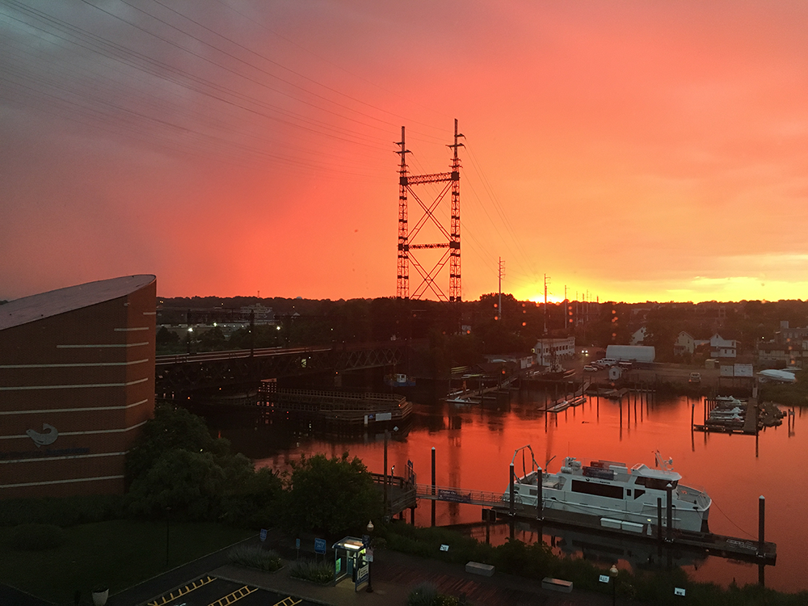
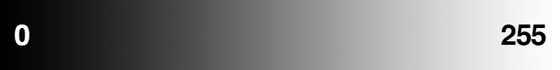
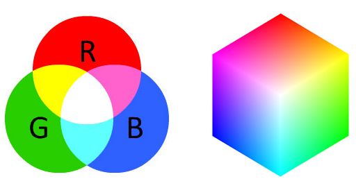
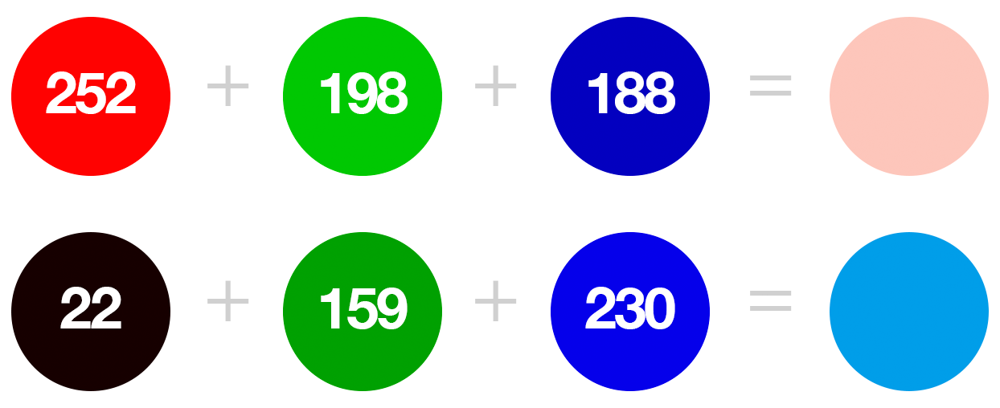
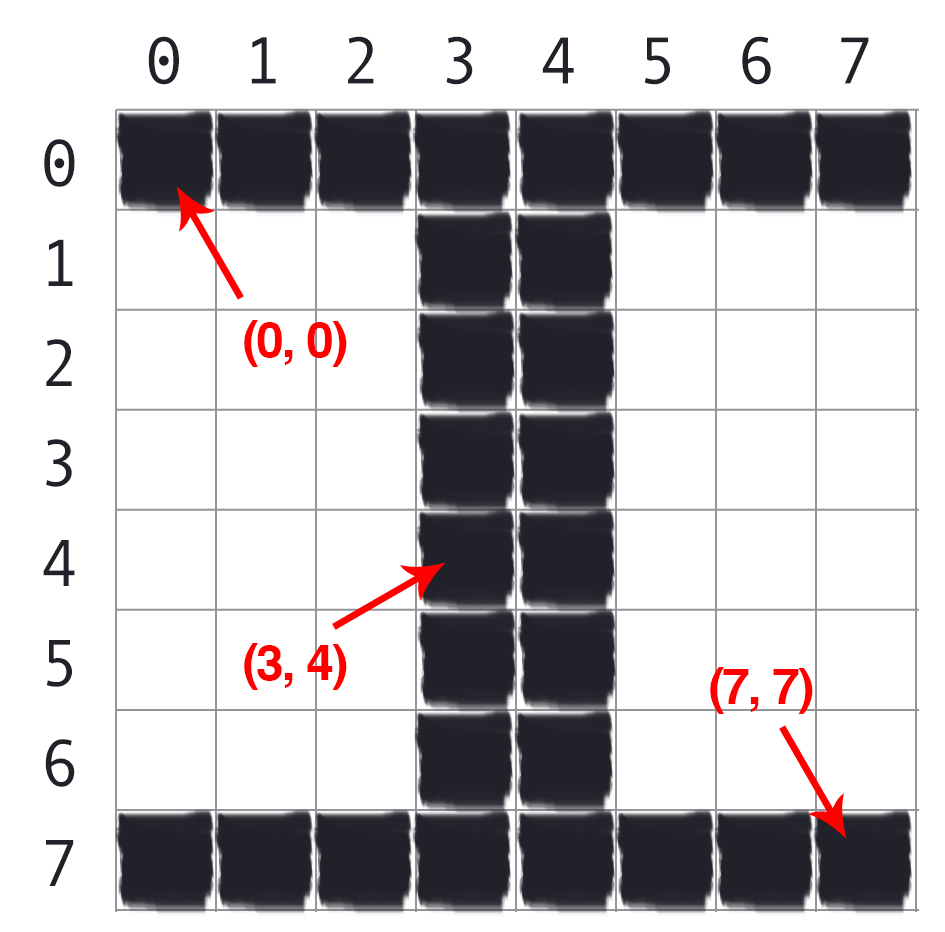
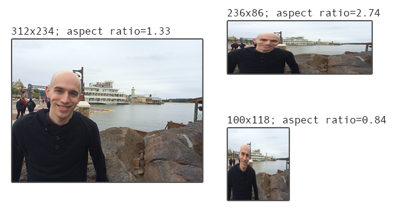
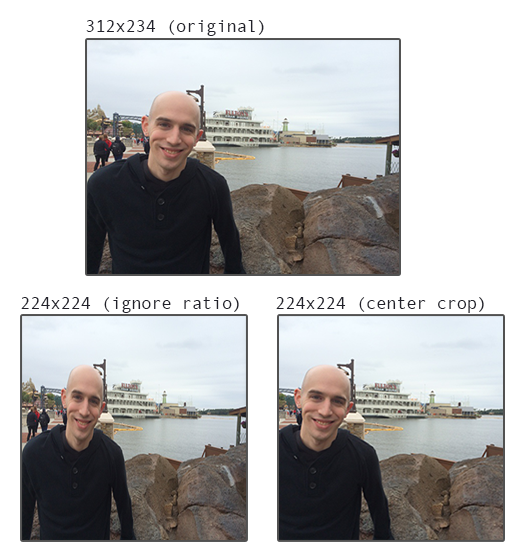

# <center> Welcome to Computer Vision</center>
 **<center>Trần Việt Anh </center>** 

 ## 3. Nguyên tắc cơ bản về hình ảnh

 Trước khi chúng ta có thể bắt đầu xây dựng bộ phân loại hình ảnh của riêng mình, trước tiên chúng ta cần hiểu hình ảnh là gì. Chúng ta sẽ bắt đầu với các khối cấu trúc của một hình ảnh - pixel. Chúng ta sẽ thảo luận chính xác pixel là gì, cách chúng được sử dụng để tạo thành một hình ảnh và cách truy cập các pixel được biểu thị dưới dạng mảng NumPy (giống như hầu hết các thư viện xử lý hình ảnh trong Python, bao gồm cả OpenCV và scikit-image). Chương này sẽ kết thúc bằng một cuộc thảo luận về tỷ lệ khung hình của một hình ảnh và mối quan hệ của nó khi chuẩn bị tập dữ liệu hình ảnh của chúng ta để huấn luyện một mạng lưới thần kinh.

 ### 3.1 Building Blocks của hình ảnh

Pixel là các khối xây dựng thô của một hình ảnh. Mỗi hình ảnh bao gồm một tập hợp các pixel. Không có độ chi tiết tốt hơn pixel. Thông thường, một pixel được coi là “màu sắc” hoặc “cường độ” của ánh sáng xuất hiện ở một vị trí nhất định trong hình ảnh của chúng ta. Nếu chúng ta nghĩ về một hình ảnh dưới dạng lưới, thì mỗi ô vuông chứa một pixel. Ví dụ, hãy xem Hình 3.1.
<center></center>
<center><font size="-1">Hình 3.1: : Hình ảnh có  1000 pixel rộng x 750 pixel cao</font></center> 
Hình ảnh trong Hình 3.1 ở trên có độ phân giải 1.000×750, nghĩa là nó rộng 1.000 pixel và cao 750 pixel. Chúng ta có thể khái niệm hóa một hình ảnh dưới dạng ma trận (đa chiều). Trong trường hợp này, ma trận của chúng tôi có 1.000 cột (chiều rộng) với 750 hàng (chiều cao). Nhìn chung, có tổng số 1.000×750 = 750.000 pixel trong hình ảnh của chúng tôi. 

Hầu hết các pixel được thể hiện theo hai cách: 
1. Hình ảnh mức xám
2. Hình ảnh

Trong ảnh thang độ xám, mỗi pixel là một giá trị vô hướng trong khoảng từ 0 đến 255, trong đó 0 tương ứng với “đen” và 255 tương ứng với “trắng”. Các giá trị từ 0 đến 255 là các sắc thái khác nhau của màu xám, trong đó các giá trị gần 0 tối hơn và các giá trị gần 255 sáng hơn. Hình ảnh độ dốc thang độ xám trong Hình 3.2 thể hiện các điểm ảnh tối hơn ở phía bên trái và các điểm ảnh sáng hơn dần dần ở phía bên phải.
<center></center>
<center><font size="-1">Hình 3.2: : Image gradient thể hiện các giá trị pixel chuyển từ đen (0) sang trắng (255).</font></center>

Các điểm ảnh trong không gian màu RGB không còn là một giá trị vô hướng như trong hình ảnh thang độ xám/một kênh – thay vào đó, các điểm ảnh được biểu thị bằng danh sách ba giá trị: một giá trị cho thành phần Đỏ, một giá trị cho Xanh lục và một giá trị khác cho Xanh lam. Để xác định màu trong mô hình màu RGB, tất cả những gì chúng ta cần làm là xác định lượng Đỏ, Xanh lục và Xanh lam có trong một pixel.
Mỗi kênh Đỏ, Xanh lục và Xanh lam có thể có các giá trị được xác định trong phạm vi [0,255] cho tổng số 256 "mức độ", trong đó 0 có nghĩa là "không biểu thị" và 255 là "biểu thị đầy đủ". Cho rằng giá trị pixel chỉ cần nằm trong phạm vi [0,255], chúng tôi thường sử dụng 8-bit unsigned integers để biểu thị cường độ.
Như chúng ta sẽ thấy khi xây dựng neural network đầu tiên của mình, chúng ta sẽ thường xử lý trước hình ảnh của mình bằng cách thực hiện phép trừ (subtraction) hoặc chia tỷ lệ (scaling), điều này sẽ yêu cầu chúng ta chuyển đổi hình ảnh thành kiểu dữ liệu float. Hãy ghi nhớ điểm này vì các loại dữ liệu được sử dụng bởi các thư viện tải hình ảnh từ disk (chẳng hạn như OpenCV) thường sẽ cần được chuyển đổi trước khi chúng tôi áp dụng trực tiếp thuật toán học cho hình ảnh.

Với ba giá trị Red, Green và Blue của chúng ta, chúng ta có thể kết hợp chúng thành một bộ RGB ở dạng (đỏ, lục, lam). Bộ này đại diện cho một màu nhất định trong không gian màu RGB. Không gian màu RGB là một ví dụ về không gian màu bổ sung: mỗi màu được thêm vào càng nhiều thì pixel càng sáng và càng gần với màu trắng. Chúng ta có thể hình dung không gian màu RGB trong Hình 3.3 (trái). Như bạn có thể thấy, thêm màu đỏ và màu xanh lá cây sẽ dẫn đến màu vàng. Thêm màu đỏ và màu xanh sẽ tạo ra màu hồng.
<center></center>
<center><font size="-1">Hình 3.3: : Hình 3.3: Bên trái: Không gian màu RGB có tính cộng. Bạn càng trộn nhiều màu đỏ, xanh lá cây và xanh dương với nhau thì bạn càng tiến gần đến màu trắng. Bên phải: Khối RGB.</font></center>

Để làm cho ví dụ này cụ thể hơn, một lần nữa chúng ta hãy xem xét màu “trắng” - chúng ta sẽ tô đầy hoàn toàn từng nhóm màu đỏ, xanh lá cây và xanh dương, như sau: (255, 255, 255). Sau đó, để tạo màu đen, chúng ta sẽ làm trống từng nhóm (0, 0, 0), vì màu đen là không có màu. Để tạo ra màu đỏ thuần, chúng ta sẽ lấp đầy chỉ số màu đỏ (và chỉ thùng màu đỏ) hoàn toàn: (255, 0, 0).

Không gian màu RGB cũng thường được hình dung dưới dạng một khối lập phương (Hình 3.3, bên phải) Vì màu RGB được định nghĩa là một bộ có 3 giá trị, mà mỗi giá trị trong phạm vi [0,255] do đó chúng ta có thể nghĩ về khối lập phương chứa 256×256 ×256 = 16.777.216 màu có thể có, tùy thuộc vào lượng Đỏ, Lục và Lam được cho vào mỗi nhóm.
<center></center>
<center><font size="-1"><b>Hình 3.4: Trên cùng</b>: Một ví dụ về việc thêm các thành phần màu Đỏ, Xanh lục và Xanh lam khác nhau lại với nhau để tạo ra "tông màu da trắng", có lẽ hữu ích trong chương trình phát hiện da. <b>Dưới cùng </b>: Tạo sắc độ xanh lam cụ thể trong logo "PyImageSearch" bằng cách trộn nhiều lượng Đỏ, Xanh lục và Xanh lam khác nhau</font></center>
Ví dụ, hãy xem chúng ta cần bao nhiêu màu đỏ, lục và lam để tạo ra một màu duy nhất (Hình 3.4, trên cùng). Ở đây, chúng tôi đặt R=252, G=198, B=188 để tạo tông màu tương tự như da của người da trắng (có lẽ hữu ích khi xây dựng ứng dụng phát hiện lượng da/thịt trong ảnh). Như chúng ta có thể thấy, thành phần Red được thể hiện rất nhiều. Màu xanh lá cây và màu xanh lam được thể hiện gần như bằng nhau. Kết hợp các màu này theo cách bổ sung, chúng ta thu được tông màu tương tự như da của người da trắng (caucasian).
Cùng thử ví dụ khác, thiết lập R=22, G=159, B = 230 để có được màu xanh lam được sử dụng trong logo PyImageSearch (Hình 3.4, dưới cùng). Ở đây, Màu đỏ được biển thị rất ít với giá trị 22 - nhóm trống đến mức giá trị Màu đỏ gần là "đen". Màu xanh lá cây đầy hơn 50% một chút trong khi Màu xanh lam đầy hơn 90%, rõ ràng là màu chủ đạo trong đại diện.
Những nhược điểm chính của không gian màu RGB bao gồm:
<ul>
    <li>Việc thêm màu  khiến con người hơi khó xác định các sắc thái màu mà không cần sử dụng công cụ “bộ chọn màu”.</li>
    <li>Nó không giống cách con người cảm nhận màu sắc</li>
</ul>
Bất chấp những nhược điểm này, gần như tất cả các hình ảnh mà bạn sẽ làm việc sẽ được thể hiện (ít nhất là ban đầu) trong không gian màu RGB. Để có đánh giá đầy đủ về mô hình màu và không gian màu, vui lòng tham khảo khóa học của PyImageSearch Gurus.

#### 3.1.1 Hình thành hình ảnh từ các kênh màu

Như chúng ta đã biết, một hình ảnh RGB được biểu thị bằng ba giá trị, một giá trị tương ứng cho mỗi thành phần Red, Green và Blue. Chúng ta có thể khái niệm hóa một hình ảnh RGB bao gồm ba ma trận độc lập có chiều rộng W và chiều cao H, một ma trận cho mỗi thành phần RGB, như trong Hình 3.5. Chúng ta có thể kết hợp ba ma trận này để thu được một mảng nhiều chiều có hình dạng W × H × D trong đó D là độ sâu hoặc số lượng kênh (đối với không gian màu RGB, D=3):
<center></center>
<center><font size="-1">Hình 3.5: Các kênh màu kết hợp lại hình thành ảnh</font></center>

Hãy nhớ rằng độ sâu của hình ảnh rất khác so với độ sâu của mạng thần kinh – điểm này sẽ trở nên rõ ràng khi chúng ta bắt đầu huấn luyện Convolutional Neural Network của riêng mình.
Tuy nhiên, hiện tại, bạn chỉ cần hiểu rằng phần lớn các hình ảnh mà bạn sẽ làm việc là: 
• Được thể hiện trong không gian màu RGB bằng ba kênh, mỗi kênh trong phạm vi [0,255]. Một pixel nhất định trong hình ảnh RGB là danh sách ba số nguyên: một giá trị cho Màu đỏ, giá trị thứ hai cho Màu lục và giá trị cuối cùng cho Màu xanh lam. 
• Được lập trình định nghĩa là một mảng đa chiều 3D NumPy có chiều rộng, chiều cao và chiều sâu.

### 3.2 Hệ tọa độ hình ảnh

<center></center>
<center><font size="-1">Hình 3.6: Chữ “I” được đặt trên một mảnh giấy kẻ ô vuông. Các pixel được truy cập theo tọa độ (x, y)- của chúng, trong đó chúng ta di chuyển x cột sang bên phải và y hàng xuống dưới, lưu ý rằng Python bắt đầu đếm từ 0.</font></center>

Như đã đề cập trong Hình 3.1 trước đó trong chương này, một hình ảnh được biểu diễn dưới dạng một lưới các điểm ảnh. Để làm cho điểm này rõ ràng hơn, hãy tưởng tượng lưới của chúng ta giống như một mảnh giấy kẻ ô vuông. Sử dụng giấy biểu đồ này, điểm gốc (0,0) tương ứng với góc trên bên trái của hình ảnh. Khi chúng ta di chuyển xuống và sang phải, cả giá trị x và y đều tăng. Hình 3.6 cung cấp một biểu diễn trực quan của biểu diễn “giấy biểu đồ” này. Ở đây chúng ta có chữ cái “I” trên một mảnh giấy kẻ ô vuông. Chúng tôi thấy rằng đây là lưới 8 × 8 với tổng số 64 pixel. Điều quan trọng cần lưu ý là chúng tôi đang đếm từ 0 chứ không phải 1. Hãy ghi nhớ điều này vì bạn sẽ tránh được nhiều nhầm lẫn sau này (đặc biệt nếu bạn đến từ môi trường MATLAB).

#### 3.2.1 Hình ảnh như mảng NumPy

Các thư viện xử lý hình ảnh như OpenCV và scikit-image biểu thị hình ảnh RGB dưới dạng mảng NumPy đa chiều có hình dạng (chiều cao, chiều rộng, chiều sâu). Những độc giả lần đầu tiên sử dụng các thư viện xử lý ảnh thường bị nhầm lẫn bởi biểu diễn này – tại sao chiều cao lại xuất hiện trước chiều rộng khi chúng ta thường nghĩ về một hình ảnh theo chiều rộng trước rồi đến chiều cao? Câu trả lời là do ký hiệu ma trận.

Khi xác định kích thước của ma trận, chúng tôi luôn viết nó dưới dạng hàng x cột. Số hàng trong ảnh là chiều cao của ảnh trong khi số cột là chiều rộng của ảnh. Độ sâu sẽ vẫn là độ sâu. Do đó, mặc dù có thể hơi khó hiểu khi xem .shape của một mảng NumPy được biểu thị dưới dạng (chiều cao, chiều rộng, chiều sâu), nhưng biểu diễn này thực sự có ý nghĩa trực quan khi xem xét cách ma trận được xây dựng và chú thích. Ví dụ: hãy xem thư viện OpenCV và hàm cv2.imread được sử dụng để tải hình ảnh từ disk và hiển thị kích thước của nó:
```python 
import cv2
image = cv2.imread("example.png")
print(image.shape)
cv2.imshow("Image", image)
cv2.waitKey(0)
```
#### 3.2.2 Thứ tự RGB và BGR
Điều quan trọng cần lưu ý là OpenCV lưu trữ các kênh RGB theo thứ tự ngược lại. Mặc dù chúng ta thường nghĩ về Red, Green và Blue, OpenCV thực sự lưu trữ các giá trị pixel theo thứ tự Blue, Green, Red. Tại sao OpenCV làm điều này? Câu trả lời đơn giản là những lý do lịch sử. Các nhà phát triển ban đầu của thư viện OpenCV đã chọn định dạng màu BGR vì thứ tự BGR phổ biến trong các nhà sản xuất máy ảnh và các nhà phát triển phần mềm khác vào thời điểm đó. Nói một cách đơn giản – thứ tự BGR này được tạo ra vì những lý do lịch sử và là một lựa chọn mà giờ đây chúng ta phải chấp nhận. Đó là một cảnh báo nhỏ, nhưng là một cảnh báo quan trọng cần ghi nhớ khi làm việc với OpenCV.

### 3.3 Tỷ lệ (scaling) và khung hình (Aspect Ratios)
<center></center>
<center><font size="-1">Hình 3.7: Chữ “I” được đặt trên một mảnh giấy kẻ ô vuông. Các pixel được truy cập theo tọa độ (x, y)- của chúng, trong đó chúng ta di chuyển x cột sang bên phải và y hàng xuống dưới, lưu ý rằng Python bắt đầu đếm từ 0.</font></center>
Chia tỷ lệ (scaling), hoặc đơn giản là thay đổi kích thước, là quá trình tăng hoặc giảm kích thước của hình ảnh về chiều rộng và chiều cao. Khi thay đổi kích thước hình ảnh, điều quan trọng cần lưu ý là tỷ lệ khung hình, là tỷ lệ giữa chiều rộng và chiều cao của hình ảnh. Bỏ qua tỷ lệ khung hình có thể dẫn đến hình ảnh trông có vẻ bị nén và biến dạng, như trong Hình 3.7.

Ở bên trái, chúng ta có hình ảnh ban đầu. Và ở trên cùng và dưới cùng, chúng ta có hai hình ảnh đã bị biến dạng do không giữ nguyên tỷ lệ khung hình. Kết quả cuối cùng là những hình ảnh này bị biến dạng, vỡ vụn và bị bóp méo. Để ngăn hành vi này, chúng tôi chỉ cần chia tỷ lệ chiều rộng và chiều cao của hình ảnh theo các lượng bằng nhau khi thay đổi kích thước hình ảnh. Từ quan điểm thẩm mỹ nghiêm ngặt, hầu như bạn luôn muốn đảm bảo tỷ lệ khung hình của hình ảnh được duy trì khi thay đổi kích thước hình ảnh – nhưng hướng dẫn này không phải lúc nào cũng phù hợp với deep learning. Hầu hết các mạng thần kinh và Convolutional Neural Networks được áp dụng cho nhiệm vụ phân loại hình ảnh đều có đầu vào có kích thước cố định, nghĩa là kích thước của tất cả các hình ảnh bạn đi qua mạng phải giống nhau. Các lựa chọn phổ biến cho kích thước hình ảnh chiều rộng và chiều cao được nhập vào Convolutional Neural Networks  bao gồm 32×32, 64×64, 224×224, 227×227, 256×256 và 299×299.

### 3.3 Tỷ lệ (scaling) và khung hình (Aspect Ratios)
<center></center>
<center><font size="-1">Hình 3.8:  Top: Hình ảnh đầu vào ban đầu của chúng tôi. Dưới cùng bên trái: Thay đổi kích thước hình ảnh thành 224×224 pixel bằng cách bỏ qua tỷ lệ khung hình. Dưới cùng bên phải: Thay đổi kích thước hình ảnh 224×224 pixel bằng cách trước tiên thay đổi kích thước dọc theo kích thước ngắn nhất rồi cắt xén ở giữa</font></center>
Giả sử chúng ta đang thiết kế một mạng cần phân loại hình ảnh 224 × 224; tuy nhiên, tập dữ liệu của chúng ta bao gồm các hình ảnh có kích thước 312×234, 800×600 và 770×300, trong số các kích thước hình ảnh khác – chúng ta phải xử lý trước những hình ảnh này như thế nào? Có phải chúng ta chỉ cần bỏ qua tỷ lệ khung hình và xử lý biến dạng (Hình 3.8, dưới cùng bên trái)? Hay chúng ta nghĩ ra một sơ đồ khác để thay đổi kích thước hình ảnh, chẳng hạn như thay đổi kích thước hình ảnh theo chiều ngắn nhất của nó và sau đó cắt xén ở giữa (Hình 3.8, dưới cùng bên phải)

Phương pháp nào là tốt nhất? Tóm lại, nó phụ thuộc. Đối với một số bộ dữ liệu, bạn có thể chỉ cần bỏ qua tỷ lệ khung hình và ép, bóp méo và nén hình ảnh của mình trước khi cung cấp chúng qua mạng của mình. Trên các tập dữ liệu khác, sẽ thuận lợi hơn khi xử lý trước chúng bằng cách thay đổi kích thước dọc theo chiều ngắn nhất và sau đó cắt lấy phần trung tâm. Chúng ta sẽ xem xét cả hai phương pháp này (và cách triển khai chúng) chi tiết hơn ở phần sau của cuốn sách này, nhưng điều quan trọng là phải giới thiệu chủ đề này ngay bây giờ khi chúng ta nghiên cứu các nguyên tắc cơ bản của hình ảnh và cách chúng được thể hiện.

### 3.4 Tổng kết 

Chương này đã xem xét các khối xây dựng cơ bản của một hình ảnh - pixel. Chúng tôi đã biết rằng hình ảnh thang độ xám/kênh đơn là được biểu thị bằng một đại lượng vô hướng duy nhất, cường độ/độ sáng của pixel. Không gian màu phổ biến nhất là không gian màu RGB trong đó mỗi pixel trong một hình ảnh được biểu thị bằng 3-tuple: một cho mỗi thành phần Red, Green và Blue tương ứng. Chúng tôi cũng biết rằng các thư viện xử lý hình ảnh và thị giác máy tính trong ngôn ngữ lập trình Python tận dụng thư viện xử lý số NumPy mạnh mẽ và do đó biểu thị hình ảnh dưới dạng mảng NumPy đa chiều. Các mảng này có hình dạng (chiều cao, chiều rộng, chiều sâu).

Chiều cao được chỉ định đầu tiên vì chiều cao là số hàng trong ma trận. Tiếp theo là chiều rộng, vì nó là số cột trong ma trận. Cuối cùng, độ sâu kiểm soát số lượng kênh trong hình ảnh. Trong không gian màu RGB, độ sâu được cố định ở độ sâu = 3.

Cuối cùng, chúng tôi kết thúc chương này bằng cách xem lại tỷ lệ khung hình của một hình ảnh và vai trò của nó khi chúng tôi thay đổi kích thước hình ảnh làm đầu vào cho neural networks và Convolutional Neural Networks của chúng tôi. Để có đánh giá chi tiết hơn về không gian màu, hệ tọa độ hình ảnh, thay đổi kích thước/tỷ lệ khung hình và các thông tin cơ bản khác về thư viện OpenCV, vui lòng tham khảo Thực hành Python và OpenCV và khóa học PyImageSearch Gurus .

[Xem tiếp chương 4](../Chuong4/chuong4.md)