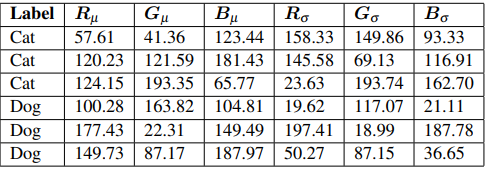

# <center> Welcome to Computer Vision</center>
 **<center>Trần Việt Anh </center>** 

 ## 4. Phân loại hình ảnh cơ bản

 chúng tôi có thể thấy và mọi thứ , hình ảnh, nghệ thuật, nội dung một cách trực quan và có thể lưu trữ kiến thức để sử dụng sau này. uy nhiên, đối với máy tính, việc diễn giải nội dung của một hình ảnh kém hơn rất nhiều – tất cả những gì máy tính của chúng tôi nhìn thấy là một ma trận lớn các con số. Nó không biết gì về suy nghĩ, kiến thức hoặc ý nghĩa mà hình ảnh đang cố gắng truyền tải. Để hiểu nội dung của một hình ảnh, chúng tôi phải áp dụng phân loại hình ảnh, đó là nhiệm vụ sử dụng thuật toán thị giác máy tính và máy học để trích xuất ý nghĩa từ một hình ảnh. Hành động này có thể đơn giản như gán nhãn cho nội dung của hình ảnh hoặc nâng cao như diễn giải nội dung của hình ảnh và trả về một câu mà con người có thể đọc được. Phân loại hình ảnh là một lĩnh vực nghiên cứu rất rộng lớn, bao gồm nhiều kỹ thuật khác nhau – và với sự phổ biến của học sâu, Deep Learning đang tiếp tục phát triển. 
 Bây giờ là lúc để thúc đẩy làn sóng phân loại hình ảnh và học sâu – những người thực hiện thành công sẽ được khen thưởng hậu hĩnh. Phân loại hình ảnh và hiểu hình ảnh hiện đang (và sẽ tiếp tục là) lĩnh vực phụ phổ biến nhất của thị giác máy tính trong mười năm tới. Trong tương lai, chúng tôi sẽ thấy các công ty như Google, Microsoft, Baidu và những công ty khác nhanh chóng có được các công ty khởi nghiệp chuyên về hình ảnh thành công. chúng tôi sẽ thấy ngày càng nhiều ứng dụng dành cho người tiêu dùng trên điện thoại thông minh có thể hiểu và diễn giải nội dung của hình ảnh. Ngay cả các cuộc chiến tranh cũng có thể sẽ được tiến hành bằng cách sử dụng máy bay không người lái được hướng dẫn tự động bằng thuật toán thị giác máy tính.<b> Trong chương này, tôi sẽ cung cấp tổng quan cấp cao về phân loại hình ảnh là gì, cùng với nhiều thách thức mà thuật toán phân loại hình ảnh phải vượt qua. Chúng tôi cũng sẽ xem xét ba loại học tập khác nhau liên quan đến phân loại hình ảnh và học máy. </b>

 Cuối cùng, tôi sẽ kết thúc chương này bằng cách thảo luận về bốn bước đào tạo mạng học sâu để phân loại hình ảnh và cách so sánh quy trình bốn bước này với quy trình trích xuất tính năng thủ công truyền thống.

 ### 4.1 Phân loại hình ảnh là gì
 Phân loại hình ảnh, về bản chất, là nhiệm vụ gán nhãn cho một hình ảnh từ một tập hợp các loại được xác định trước. Thực tế, điều này có nghĩa là nhiệm vụ của chúng tôi là phân tích một hình ảnh đầu vào và trả về một nhãn phân loại hình ảnh. Nhãn luôn là từ một tập hợp các dữ liệu có thể được xác định trước. Ví dụ: giả sử rằng tập hợp các nhãn của dữ liệu của chúng tôi bao gồm: categories  = {cat, dog, panda} Sau đó, chúng tôi trình bày hình ảnh sau (Hình 4.1) cho hệ thống phân loại của mình:
 <center></center>
<center><font size="-1">Hình 4.1: : Mục tiêu của một hệ thống phân loại hình ảnh là lấy một hình ảnh đầu vào và gán nhãn dựa trên một tập hợp các danh mục được xác định trước. </font></center> 


Mục tiêu của chúng tôi ở đây là lấy hình ảnh đầu vào này và gán nhãn cho nó từ bộ danh mục của chúng tôi – trong trường hợp này là con chó. Hệ thống phân loại có thể ra nhiều nhãn cho 1 hình ảnh đó, ví dụ như : dog: 95%; cat: 4%; panda: 1%.

Chính xác hơn, với hình ảnh đầu vào của chúng tôi là W × H pixel với ba kênh tương ứng là Đỏ, Xanh lục và Xanh lam, mục tiêu của chúng tôi là lấy hình ảnh W × H × 3 = N pixel và tìm ra cách phân loại chính xác nội dung của bức hình

#### 4.1.1 Lưu ý về điểm dữ liệu
Khi thực hiện học máy và học sâu, chúng tôi có một bộ dữ liệu mà chúng tôi đang cố gắng trích xuất kiến ​​thức từ đó. Mỗi ví dụ/mục trong tập dữ liệu (dù là dữ liệu hình ảnh, dữ liệu văn bản, dữ liệu âm thanh, v.v.) đều là một điểm dữ liệu. Do đó, một bộ dữ liệu là một tập hợp các điểm dữ liệu (Hình 4.2)
 <center></center>
<center><font size="-1">Hình 4.2: :  bộ dữ liệu là một tập hợp các điểm dữ liệu </font></center> 

Mục tiêu của chúng tôi là áp dụng thuật toán học máy và học sâu để khám phá các mẫu cơ bản trong tập dữ liệu, cho phép chúng tôi phân loại chính xác các điểm dữ liệu mà thuật toán của chúng tôi chưa gặp phải. Bây giờ hãy dành thời gian để làm quen với thuật ngữ này:
1. Trong chủ đề phân loại hình ảnh, tập dữ liệu của chúng tôi là một tập hợp các hình ảnh.
2. Do đó, mỗi hình ảnh là một điểm dữ liệu.
Tôi sẽ sử dụng thuật ngữ hình ảnh và điểm dữ liệu thay thế cho nhau trong suốt phần còn lại của cuốn sách này, vì vậy hãy ghi nhớ điều này ngay bây giờ.

#### 4.1.2 Khoảng cách phương diện (The Semantic Gap)
 <center></center>
<center><font size="-1">Hình 4.3: Trên cùng: Bộ não của chúng tôi có thể thấy rõ sự khác biệt giữa hình ảnh có con mèo và hình ảnh có con chó. Dưới cùng: Tuy nhiên, tất cả những gì máy tính "thấy" là một ma trận lớn các con số. Sự khác biệt giữa cách chúng tôi cảm nhận một hình ảnh và cách hình ảnh được thể hiện (một ma trận các số) được gọi là khoảng cách phương diện </font></center> 
chúng tôi có thể mô tả hình ảnh thông qua không gian, màu sắc, kết cấu. Vậy làm sao chúng tôi có thể mã hóa tất cả thông tin này theo cách mà máy tính có thể hiểu được ? Câu trả lời là áp dụng trích xuất tính năng để định lượng nội dung của hình ảnh. Trích xuất tính năng là quá trình lấy ảnh đầu vào, áp dụng thuật toán và thu được một vectơ đặc trưng (tức là danh sách các số) định lượng hình ảnh của chúng tôi.

Để thực hiện quy trình này, chúng tôi có thể cân nhắc áp dụng các tính năng được thiết kế thủ công như HOG, LBP hoặc các phương pháp tiếp cận “truyền thống” khác để định lượng hình ảnh. Một phương pháp khác, và phương pháp được sử dụng trong cuốn sách này, là áp dụng học sâu để tự động tìm hiểu một tập hợp các tính năng có thể được sử dụng để định lượng và cuối cùng là gắn nhãn cho chính nội dung của hình ảnh. Tuy nhiên, nó không đơn giản như vậy. . . bởi vì một khi chúng tôi bắt đầu kiểm tra hình ảnh trong thế giới thực, chúng tôi phải đối mặt với rất nhiều thách thức.
#### 4.1.3 Các thách thức
Nếu khoảng cách phương diện không đủ là một vấn đề, chúng tôi cũng phải xử lý các yếu tố biến thể trong cách một hình ảnh hoặc đối tượng xuất hiện. Hình 4.5 hiển thị hình ảnh trực quan của một số
các yếu tố biến đổi này.
 <center></center>
<center><font size="-1">Hình 4.4: Khi phát triển một hệ thống phân loại hình ảnh, chúng ta cần nhận thức được cách một đối tượng có thể xuất hiện ở các góc nhìn, điều kiện ánh sáng, che khuất, tỷ lệ khác nhau, v.v.. </font></center> 
<ul>
    <li><b> viewpoint variation:</b> Có nhiều góc nhìn khác nhau, nhưng vẫn là thiết bị đó </li>
    <li><b> scale variation:</b> Có kích thước khác nhau nhưng vẫn là chiếc cốc đó </li>
    <li><b>deformation:</b> Có biến dạng nhiều cách khác nhau, nhưng vẫn là nhân vật hoạt hình đó </li>
    <li><b>occlusions:</b> Có bị che khuất, bị thoát khỏi tầm nhìn nhưng vẫn là con chó đó </li>
    <li><b>illumination:</b> Ở môi trường và điều kiện sáng khác nhau, nhưng vẫn là chiếc cốc đó </li>
    <li><b>background clutter:</b> Ở môi trường bị nhiều tiếng ồn và phức tạp khác nhau, thì vẫn có nhân vật đó trong bức ảnh </li>
    <li><b>intra-class variationr:</b> Chiếc ghế có sự đa dạng khác nhau, nhưng vẫn có thể phân loại chính xác các biến thể đó </li>
</ul>

Bạn bắt đầu cảm thấy hơi choáng ngợp với sự phức tạp của việc xây dựng bộ phân loại hình ảnh? Còn rất nhiều biến thể  khác vậy làm thế nào để chúng ta giải thích được số lượng biến thể đáng kinh ngạc như vậy trong các đối tượng.

Các hệ thống thị giác máy tính, phân loại hình ảnh và học sâu thành công được triển khai trong thế giới thực đưa ra các giả định và cân nhắc cẩn thận trước khi viết một dòng mã. Nếu bạn áp dụng cách tiếp cận quá rộng, chẳng hạn như “Tôi muốn phân loại và phát hiện từng đồ vật trong nhà bếp của mình”, (nơi có thể có hàng trăm đồ vật khả thi) thì hệ thống phân loại của bạn khó có thể hoạt động tốt trừ khi bạn có nhiều năm kinh nghiệm. xây dựng bộ phân loại hình ảnh – và thậm chí sau đó, không có gì đảm bảo cho sự thành công của dự án. Nhưng nếu bạn đóng khung vấn đề của mình và thu hẹp phạm vi, chẳng hạn như “Tôi chỉ muốn nhận ra bếp và tủ lạnh”, thì hệ thống của bạn có nhiều khả năng hoạt động và chính xác hơn, đặc biệt nếu đây là lần đầu tiên bạn làm việc với phân loại hình ảnh và học sâu. Điểm mấu chốt ở đây là luôn xem xét phạm vi của bộ phân loại hình ảnh của bạn. Mặc dù deep learning và Convolutional Neural Networks đã thể hiện sức mạnh đáng kể và khả năng phân loại trước nhiều thách thức khác nhau, nhưng bạn vẫn nên giữ phạm vi dự án của mình chặt chẽ và được xác định rõ ràng nhất có thể.

Hãy nhớ rằng ImageNet, bộ dữ liệu điểm chuẩn thực tế cho các thuật toán phân loại hình ảnh, bao gồm 1.000 đối tượng mà chúng ta gặp trong cuộc sống hàng ngày – và bộ dữ liệu này vẫn được các nhà nghiên cứu tích cực sử dụng để cố gắng thúc đẩy state-of-the-art của Deep Learning Forward. DeepLearning không phải là phép thuật. Thay vào đó, học sâu giống như một chiếc cưa trong nhà để xe của bạn – mạnh mẽ và hữu ích khi được sử dụng đúng cách, nhưng nguy hiểm nếu được sử dụng mà không có sự cân nhắc thích hợp. Trong suốt phần còn lại của cuốn sách này, tôi sẽ hướng dẫn bạn về hành trình học sâu và giúp chỉ ra khi nào bạn nên tiếp cận với những công cụ mạnh mẽ này và khi nào bạn nên tham khảo một cách tiếp cận đơn giản hơn (hoặc đề cập nếu một vấn đề không hợp lý đối với hình ảnh). phân loại để giải).

### 4.2 Các loại học 
#### 4.2.1 Học có giám sát (Supervised Learning)
Hãy tưởng tượng điều này: bạn vừa tốt nghiệp đại học với bằng Cử nhân Khoa học Máy tính. Bạn còn trẻ. Phá sản. Và đang tìm kiếm một công việc trong lĩnh vực này – có lẽ bạn thậm chí còn cảm thấy lạc lõng trong quá trình tìm kiếm việc làm của mình. Nhưng trước khi bạn biết điều đó, một nhà tuyển dụng của Google đã tìm thấy bạn trên LinkedIn và mời bạn làm việc trên phần mềm Gmail của họ. Bạn sẽ lấy nó chứ? Rất có thể. Vài tuần sau, bạn đến khuôn viên hoành tráng của Google ở Mountain View, California, bị choáng ngợp bởi phong cảnh ngoạn mục, đội xe Teslas trong bãi đậu xe và những hàng thức ăn ngon hầu như không bao giờ cạn trong quán ăn tự phục vụ. Cuối cùng, bạn ngồi xuống bàn làm việc của mình trong một không gian làm việc rộng rãi giữa hàng trăm nhân viên khác. . . và sau đó bạn tìm ra vai trò của mình trong công ty. Bạn được thuê để tạo một phần mềm tự động phân loại email là thư rác hoặc không phải thư rác
Làm thế nào sẽ đạt được mục tiêu này? Một cách tiếp cận dựa trên quy tắc làm việc? Bạn có thể viết một loạt các câu lệnh if/else tìm kiếm một số từ nhất định và sau đó xác định xem một email có phải là thư rác hay không dựa trên các quy tắc này? Điều đó có thể chạy. . . chỉ đến một mức độ. Nhưng cách tiếp cận này cũng sẽ dễ dàng bị đánh bại và gần như không thể duy trì.
Thay vào đó, những gì bạn thực sự cần là học máy. Bạn cần một bộ đào tạo bao gồm chính các email cùng với nhãn của chúng, trong trường hợp này là thư rác hoặc không phải thư rác. Với dữ liệu này, bạn có thể phân tích văn bản (nghĩa là phân phối các từ) trong email và sử dụng các nhãn thư rác/không phải thư rác để dạy cho bộ phân loại học máy những từ nào xuất hiện trong một email rác và từ nào không – tất cả đều không cần tạo một loạt câu lệnh if/else dài và phức tạp.
Ví dụ về việc tạo hệ thống lọc thư rác này là một ví dụ về học có giám sát.<b> Học có giám sát (Supervised learning)</b> được cho là loại máy học nổi tiếng và được nghiên cứu nhiều nhất. Với dữ liệu đào tạo của chúng tôi, một mô hình (hoặc “phân loại”) được tạo thông qua quy trình đào tạo trong đó các dự đoán được đưa ra trên dữ liệu đầu vào và sau đó được sửa khi các dự đoán sai. Quá trình đào tạo này tiếp tục cho đến khi mô hình đạt được một số tiêu chí dừng mong muốn, chẳng hạn như tỷ lệ lỗi thấp hoặc số lần lặp đào tạo tối đa.

Các thuật toán học có giám sát phổ biến bao gồm Hồi quy logistic, Support Vector Machines(SVM), Random Forests và Artificial Neural Networks. Trong phân loại hình ảnh, chúng tôi giả định rằng tập dữ liệu hình ảnh của chúng tôi bao gồm chính các hình ảnh cùng với nhãn lớp tương ứng của chúng mà chúng tôi có thể sử dụng để dạy cho trình phân loại học máy của mình mỗi danh mục “trông như thế nào”. Nếu trình phân loại của chúng tôi đưa ra dự đoán không chính xác, thì chúng tôi có thể áp dụng các phương pháp để sửa lỗi của nó.
 <center></center>
<center><font size="-1">Bảng 4.1: Một bảng dữ liệu chứa cả nhãn lớp (chó hoặc mèo) và các vectơ đặc trưng cho từng điểm dữ liệu (tương ứng là độ lệch chuẩn và giá trị trung bình của từng kênh màu Đỏ, Xanh lục và Xanh lam). Đây là một ví dụ về nhiệm vụ phân loại được giám sát.</font></center> 
Sự khác biệt giữa học có giám sát, không giám sát và bán giám sát có thể được hiểu rõ nhất bằng cách xem ví dụ trong Bảng 4.1. Cột đầu tiên trong bảng của chúng tôi là nhãn được liên kết với một hình ảnh cụ thể. Sáu cột còn lại tương ứng với vectơ đặc trưng của chúng tôi cho từng điểm dữ liệu – ở đây, chúng tôi đã chọn định lượng nội dung hình ảnh của mình bằng cách tính giá trị trung bình và độ lệch chuẩn cho từng kênh màu RGB tương ứng. Thuật toán học có giám sát của chúng tôi sẽ đưa ra dự đoán trên từng vectơ đặc trưng này và nếu nó đưa ra dự đoán không chính xác, chúng tôi sẽ cố gắng sửa nó bằng cách cho nó biết nhãn chính xác thực sự là gì. Sau đó, quá trình này sẽ tiếp tục cho đến khi đạt được tiêu chí dừng mong muốn, chẳng hạn như độ chính xác, số lần lặp lại của quá trình học hoặc đơn giản là khoảng thời gian tùy ý.

### 4.2.2 Học không giám sát (Unsupervised Learning)

Trái ngược với học có giám sát, học không giám sát (đôi khi được gọi là học bằng cách tự học) không có nhãn liên kết với dữ liệu đầu vào và do đó chúng ta không thể sửa mô hình của mình nếu mô hình đưa ra dự đoán sai. Quay trở lại ví dụ về bảng tính, việc chuyển đổi một bài toán học có giám sát thành một bài toán học không giám sát cũng đơn giản như việc xóa cột “nhãn” (Bảng 4.2). Học không giám sát đôi khi được coi là “chén thánh” của học máy và phân loại hình ảnh. Khi xem xét số lượng hình ảnh trên Flickr hoặc số lượng video trên YouTube, chúng tôi nhanh chóng nhận ra rằng có một lượng lớn dữ liệu chưa được gắn nhãn có sẵn trên internet. Nếu chúng ta có thể làm cho thuật toán của mình tìm hiểu các mẫu từ dữ liệu chưa được gắn nhãn, thì chúng ta sẽ không phải tốn nhiều thời gian (và tiền bạc) để dán nhãn hình ảnh cho các tác vụ được giám sát một cách gian khổ. 
 <center></center>
<center><font size="-1">Bảng 4.2: Các thuật toán học không giám sát cố gắng học các mẫu cơ bản trong tập dữ liệu không có nhãn lớp. Trong ví dụ này, chúng tôi đã loại bỏ cột nhãn lớp, do đó biến nhiệm vụ này thành một vấn đề học tập không giám sát.</font></center> 
Hầu hết các thuật toán học không giám sát thành công nhất khi chúng ta có thể tìm hiểu cấu trúc cơ bản của tập dữ liệu và sau đó áp dụng các tính năng đã học của chúng ta cho một vấn đề học có giám sát khi có quá ít dữ liệu được gắn nhãn để sử dụng.

Các thuật toán học máy cổ điển dành cho học không giám sát bao gồm Principle Component Analysis(PCA) và phân cụm k-mean. Cụ thể đối với neural networks, chúng ta thấy Bộ mã hóa tự động, Bản đồ tự tổ chức (SOM) và Lý thuyết cộng hưởng thích ứng được áp dụng cho học tập không giám sát. Học tập không giám sát là một lĩnh vực nghiên cứu cực kỳ tích cực và vẫn  được giải quyết. Chúng tôi không tập trung vào học tập không giám sát trong cuốn sách này.

### 4.2.3 Học bán giám sát

Vì vậy, điều gì sẽ xảy ra nếu chúng ta chỉ có một số nhãn được liên kết với dữ liệu của mình và không có nhãn nào cho dữ liệu khác? Có cách nào để chúng ta có thể áp dụng kết hợp giữa học có giám sát và không giám sát mà vẫn có thể phân loại từng điểm dữ liệu không? Hóa ra câu trả lời là có – chúng ta chỉ cần áp dụng phương pháp học bán giám sát. Quay trở lại ví dụ về bảng tính của chúng ta, giả sử chúng ta chỉ có nhãn cho một phần nhỏ dữ liệu đầu vào (Bảng 4.3). Thuật toán học bán giám sát của chúng tôi sẽ lấy các phần dữ liệu đã biết, phân tích chúng và cố gắng gắn nhãn cho từng điểm dữ liệu chưa được gắn nhãn để sử dụng làm dữ liệu huấn luyện bổ sung. Quá trình này có thể lặp lại nhiều lần vì thuật toán bán giám sát học “cấu trúc” của dữ liệu để đưa ra dự đoán chính xác hơn và tạo dữ liệu huấn luyện đáng tin cậy hơn. Học bán giám sát đặc biệt hữu ích trong thị giác máy tính, thường tốn thời gian, tẻ nhạt và tốn kém (ít nhất là về số giờ làm việc) để gắn nhãn cho từng hình ảnh trong tập huấn luyện của chúng tôi.
 <center></center>
<center><font size="-1">Bảng 4.3: Khi thực hiện học bán giám sát, chúng tôi chỉ có các nhãn cho một tập hợp con của các vectơ hình ảnh/đặc trưng và phải cố gắn nhãn cho các điểm dữ liệu khác để sử dụng chúng làm dữ liệu huấn luyện bổ sung</font></center> 
rong trường hợp đơn giản là chúng tôi không có thời gian hoặc tài nguyên để gắn nhãn cho từng hình ảnh riêng lẻ, chúng tôi chỉ có thể gắn nhãn cho một phần nhỏ dữ liệu của mình và sử dụng phương pháp học bán giám sát để gắn nhãn và phân loại phần còn lại của hình ảnh. Các thuật toán học bán giám sát thường trao đổi các bộ dữ liệu đầu vào được gắn nhãn nhỏ hơn để giảm độ chính xác phân loại ở mức chấp nhận được. Thông thường, thuật toán học có giám sát đào tạo được gắn nhãn càng chính xác thì nó càng có thể đưa ra các dự đoán chính xác hơn (điều này đặc biệt đúng đối với các thuật toán học sâu).

Khi lượng dữ liệu đào tạo giảm, độ chính xác chắc chắn sẽ bị ảnh hưởng. Học bán giám sát tính đến mối quan hệ giữa độ chính xác và lượng dữ liệu và cố gắng giữ độ chính xác của phân loại trong giới hạn có thể chấp nhận được đồng thời giảm đáng kể lượng dữ liệu đào tạo cần thiết để xây dựng mô hình – kết quả cuối cùng là một bộ phân loại chính xác với ít nỗ lực hơn(nhưng thông thường không phải là chính xác như một bộ phân loại được giám sát) và dữ liệu huấn luyện hơn.
Các lựa chọn phổ biến cho học bán giám sát bao gồm label spreading, label propagation, ladder networks, and co-learning/co-training . Một lần nữa, chúng ta sẽ chủ yếu tập trung vào học có giám sát trong cuốn sách này, vì cả học không giám sát và bán giám sát trong bối cảnh học sâu cho thị giác máy tính vẫn là những chủ đề nghiên cứu rất tích cực mà không có hướng dẫn rõ ràng về phương pháp sử dụng.

### 4.3 The Deep Learning Classification Pipeline

Dựa trên hai phần trước của chúng tôi về phân loại hình ảnh và các loại thuật toán học tập, bạn có thể bắt đầu cảm thấy hơi bối rối với các thuật ngữ, cân nhắc mới và những gì có vẻ như là một lượng biến thể không thể vượt qua trong việc xây dựng một bộ phân loại hình ảnh, nhưng sự thật là việc xây dựng bộ phân loại hình ảnh khá đơn giản, khi bạn hiểu quy trình. Trong phần này, chúng ta sẽ xem xét một sự thay đổi quan trọng trong tư duy mà bạn cần thực hiện khi làm việc với máy học. Từ đó, tôi sẽ xem xét bốn bước xây dựng bộ phân loại hình ảnh dựa trên học sâu cũng như so sánh và đối chiếu học máy dựa trên tính năng truyền thống với học sâu từ đầu đến cuối.

### 4.4 Một sự thay đổi trong tư duy

Trước khi đi sâu vào bất cứ điều gì phức tạp, hãy bắt đầu với một thứ mà tất cả chúng ta (rất có thể) đều quen thuộc: dãy Fibonacci. 
Dãy số Fibonacci là một dãy số mà số tiếp theo của dãy được tìm bằng cách tính tổng hai số nguyên trước nó.
Ví dụ, cho dãy 0, 1, 1, số tiếp theo được tìm bằng cách cộng 1+1 = 2. Tương tự, cho 0, 1, 1, 2, số tiếp theo trong dãy là 1+2 = 3. Theo quy luật đó , số đầu tiên của dãy số như sau: 0, 1, 1, 2, 3, 5, 8, 13, 21, 34, ... Tất nhiên, chúng ta cũng có thể xác định mẫu này trong một (không tối ưu hóa ) Hàm Python sử dụng đệ quy:
```python 
def fib(n):
    if n == 0:
        return 0
    elif n == 1:
        return 1
    else:
        return fib(n-1) + fib(n-2)
```
Sử dụng mã này, chúng ta có thể tính toán số thứ n trong chuỗi bằng cách cung cấp giá trị n cho hàm fib. Ví dụ: hãy tính số thứ 7 trong dãy Fibonacci:
```python 
>>> fib(7)
13
```
Như bạn có thể thấy, dãy Fibonacci rất đơn giản và là một ví dụ về một nhóm các hàm:
 1. Nhận một đầu vào, trả về một đầu ra.
 2. Quy trình được xác định rõ ràng. 
 3. Đầu ra có thể dễ dàng kiểm chứng tính chính xác. 
 4. Bản thân nó phù hợp với phạm vi code và bộ kiểm tra. 

Nói chung, bạn có thể đã viết hàng nghìn hàng nghìn hàm thủ tục như thế này trong đời. Cho dù bạn đang tính toán một dãy Fibonacci, lấy dữ liệu từ cơ sở dữ liệu hay tính toán giá trị trung bình và độ lệch chuẩn từ một danh sách các số, tất cả các hàm này đều được xác định rõ ràng và dễ dàng kiểm chứng tính chính xác

Thật không may, đây không phải là trường hợp học sâu và phân loại hình ảnh! Nhớ lại ở Phần 4.1.2 chúng ta đã xem hình ảnh của một con mèo và một con chó, sao chép trong Hình 4.6 để tiện theo dõi. Bây giờ, hãy tưởng tượng bạn đang cố gắng viết một hàm thủ tục không chỉ cho biết sự khác biệt giữa hai bức ảnh này mà còn cho bất kỳ bức ảnh nào về con mèo và con chó. Làm thế nào bạn sẽ đi về hoàn thành nhiệm vụ này? Bạn có kiểm tra các giá trị pixel riêng lẻ ở các tọa độ (x, y) khác nhau không? Viết hàng trăm hàng if/else ?Và bạn sẽ duy trì và xác minh tính đúng đắn của hệ thống dựa trên quy tắc khổng lồ như thế nào? Câu trả lời ngắn gọn là: bạn không.

### 4.3.2 bước 1: Làm dataset

Thành phần đầu tiên của việc xây dựng mạng học sâu là thu thập tập dữ liệu ban đầu của chúng tôi. Chúng tôi cần các hình ảnh cũng như các nhãn được liên kết với mỗi hình ảnh. Các nhãn này phải đến từ một tập hợp danh mục hữu hạn, chẳng hạn như: danh mục = chó, mèo, gấu trúc. Hơn nữa, số lượng hình ảnh cho mỗi danh mục phải gần như đồng nhất (nghĩa là cùng số lượng ví dụ cho mỗi danh mục). Nếu chúng ta có số lượng hình ảnh con mèo gấp đôi so với hình ảnh con chó và số lượng hình ảnh gấu trúc gấp năm lần so với hình ảnh con mèo, thì bộ phân loại của chúng ta sẽ trở nên thiên về việc khớp quá mức vào các danh mục được đại diện nhiều này. Mất cân bằng lớp là một vấn đề phổ biến trong học máy và tồn tại một số cách để khắc phục nó. Chúng ta sẽ thảo luận về một số phương pháp này ở phần sau của cuốn sách này, nhưng hãy nhớ rằng phương pháp tốt nhất để tránh các vấn đề học tập do mất cân bằng lớp học đơn giản là tránh hoàn toàn sự mất cân bằng lớp học.

### 4.3.3 bước 2: Chia dataset
Bây giờ chúng ta đã có tập dữ liệu ban đầu, chúng ta cần chia nó thành hai phần: 
1. Tập huấn luyện  (Training Set)
2. Tập kiểm tra (Test set)
 Tập huấn luyện được bộ phân loại của chúng ta sử dụng để “tìm hiểu” xem mỗi danh mục trông như thế nào bằng cách đưa ra dự đoán về đầu vào dữ liệu và sau đó tự sửa khi dự đoán sai. Sau khi bộ phân loại đã được đào tạo, chúng tôi có thể đánh giá hiệu suất trên một bộ kiểm tra. Điều cực kỳ quan trọng là tập huấn luyện và tập kiểm tra phải độc lập với nhau và không trùng lặp! Nếu bạn sử dụng bộ thử nghiệm của mình như một phần của dữ liệu huấn luyện, thì trình phân loại của bạn có lợi thế không công bằng vì nó đã xem các ví dụ thử nghiệm trước đó và “học hỏi” từ chúng. Thay vào đó, bạn phải giữ bộ thử nghiệm này tách biệt hoàn toàn với quy trình đào tạo của mình và chỉ sử dụng nó để đánh giá network của bạn.

 ### 4.3.4 bước 3: Huấn luyện network 
 Với bộ hình ảnh đào tạo của chúng tôi, giờ đây chúng tôi có thể đào tạo network của mình. Mục tiêu ở đây là để network của chúng tôi học cách nhận ra từng danh mục trong dữ liệu được gắn nhãn của chúng tôi. Khi mô hình mắc lỗi, nó sẽ học hỏi từ sai lầm này và tự cải thiện. Vì vậy, làm thế nào để "học tập" thực sự làm việc? Nói chung, chúng tôi áp dụng một hình thức gradient descent, như đã thảo luận trong Chương 9. Phần còn lại của cuốn sách này được dành để trình bày cách đào tạo mạng lưới thần kinh từ đầu, vì vậy chúng tôi sẽ hoãn thảo luận chi tiết về quy trình đào tạo cho đến lúc đó
 ### 4.3.5 bước 4: Đánh giá
 Cuối cùng, chúng tôi cần đánh giá mạng được đào tạo của mình. Đối với mỗi hình ảnh trong bộ thử nghiệm của chúng tôi, chúng tôi trình bày chúng với network và yêu cầu network dự đoán nhãn của hình ảnh là gì. Sau đó, chúng tôi lập bảng các dự đoán của mô hình cho một hình ảnh trong bộ thử nghiệm. Cuối cùng, những dự đoán mô hình này được so sánh với nhãn sự thật cơ bản từ bộ thử nghiệm của chúng tôi. Các nhãn sự thật cơ bản đại diện cho danh mục hình ảnh thực sự là gì. Từ đó, chúng tôi có thể tính toán số lượng dự đoán mà bộ phân loại của chúng tôi đã đúng và tính toán các báo cáo tổng hợp như độ chính xác, thu hồi và thước đo f, được sử dụng để định lượng hiệu suất của toàn bộ network của chúng tôi

 [Xem tiếp chương 5](../Chuong5/chuong5.md)