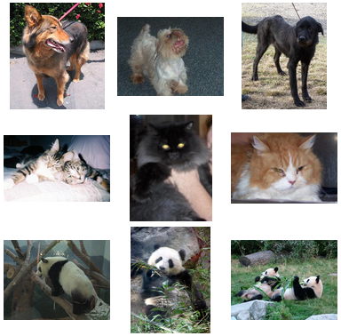
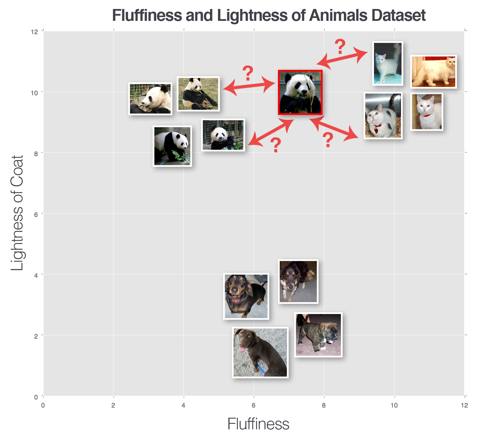
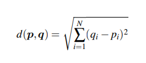
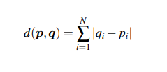
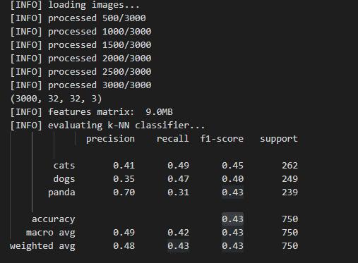

# <center> Welcome to Computer Vision</center>
 **<center>Trần Việt Anh </center>** 

 ## 7. Phân loại hình ảnh đầu tiên
Trong vài chương trước, chúng tôi đã dành khá nhiều thời gian để thảo luận về các nguyên tắc cơ bản về hình ảnh, các loại hình học tập và thậm chí là quy trình bốn bước mà chúng ta có thể tuân theo khi xây dựng bộ phân loại hình ảnh của riêng mình. Điều đó sẽ thay đổi trong chương này. Chúng ta sẽ bắt đầu bằng cách xây dựng một số tiện ích trợ giúp để hỗ trợ quá trình tiền xử lý và tải hình ảnh từ disk.
Từ đó, chúng ta sẽ thảo luận về trình phân loại k-Nearest Neighbors (k-NN), lần đầu tiên bạn tiếp xúc với việc sử dụng máy học để phân loại hình ảnh. Trên thực tế, thuật toán này đơn giản đến mức nó hoàn toàn không thực hiện bất kỳ hoạt động “học tập” nào – tuy nhiên, đây vẫn là một thuật toán quan trọng cần xem xét để chúng ta có thể đánh giá được cách các mạng lưới thần kinh học hỏi từ dữ liệu trong các giai đoạn tiếp theo trong tương lai. Cuối cùng, chúng tôi sẽ áp dụng thuật toán k-NN của mình để nhận dạng các loài động vật khác nhau trong ảnh.

### 7.1 Làm việc với dataset hình

Đầu tiên, phải xem xét tập dữ liêu có phù hợp với thiết bị máy tính đang sử dụng, dành thời gian để tổ chức, tiền xử lý và tải tập dữ liệu của bạn là một khía cạnh quan trọng trong việc xây dựng bộ phân loại hình ảnh.
#### 7.1 Giới thiệu dataset động vật

Bộ dữ liệu “Động vật” là một bộ dữ liệu ví dụ đơn giản mà tôi tập hợp lại để trình bày cách huấn luyện bộ phân loại hình ảnh bằng các kỹ thuật máy học đơn giản cũng như các thuật toán học sâu nâng cao.

<center></center>
<center><font size="-1">Hình 7.1:  Ví dụ của 3 lớp ảnh động vật trong tập dữ liệu 1000 tấm gồm dog,cat,panda</font></center>

Hình ảnh bên trong bộ dữ liệu Động vật thuộc ba lớp riêng biệt: chó, mèo và gấu trúc, với 1.000 hình ảnh mẫu cho mỗi lớp. Hình ảnh chó và mèo được lấy mẫu từ thử thách Kaggle Dogs vs. Cats trong khi hình ảnh gấu trúc được lấy mẫu từ thử thách Kaggle Dogs và Cats của bộ dữ liệu ImageNet. Chỉ chứa 3.000 hình ảnh, bộ dữ liệu Động vật có thể dễ dàng vừa với bộ nhớ chính của máy của chúng tôi, điều này sẽ giúp đào tạo các mô hình của chúng tôi nhanh hơn nhiều mà không yêu cầu chúng tôi viết bất kỳ “mã chi phí” nào để quản lý một bộ dữ liệu không thể vừa với bộ nhớ. Hơn hết, một mô hình học sâu có thể nhanh chóng được đào tạo trên tập dữ liệu này trên CPU hoặc GPU. Bất kể thiết lập phần cứng của bạn là gì, bạn có thể sử dụng bộ dữ liệu này để tìm hiểu kiến thức cơ bản về học máy và học sâu. Mục tiêu của chúng ta trong chương này là tận dụng bộ phân loại k-NN để cố gắng nhận dạng từng loài này trong một hình ảnh chỉ bằng cách sử dụng cường độ pixel thô (tức là không diễn ra quá trình trích xuất đặc trưng). Như chúng ta sẽ thấy, cường độ pixel thô không phù hợp với thuật toán k-NN. Tuy nhiên, đây là một thử nghiệm điểm chuẩn quan trọng cần chạy để chúng tôi có thể đánh giá cao lý do tại sao Mạng thần kinh chuyển đổi có thể đạt được độ chính xác cao như vậy đối với cường độ pixel thô trong khi các thuật toán học máy truyền thống không làm được như vậy.
Như tôi đã đề cập trong Phần 1.5, chúng ta sẽ xây dựng bộ công cụ học sâu tùy chỉnh của riêng mình trong toàn bộ cuốn sách này. mạng thần kinh tích chập tiên tiến nhất. Trên thực tế, đây chính là bộ công cụ mà tôi sử dụng khi thực hiện các thử nghiệm học sâu của riêng mình. -thư viện chính thức có thể được sử dụng để nhanh chóng xây dựng và đào tạo các mạng học sâu tùy chỉnh của riêng bạn.
Như bạn có thể thấy, chúng tôi có một mô-đun tên là pyimagesearch. Tất cả mã mà chúng tôi phát triển sẽ tồn tại bên trong mô-đun pyimagesearch. Với mục đích của chương này, chúng ta sẽ cần xác định hai module con:
```python 
|--- pyimagesearch
| |--- __init__.py
| |--- datasets
| | |--- __init__.py
| | |--- simpledatasetloader.py
| |--- preprocessing
| | |--- __init__.py
| | |--- simplepreprocessor.py
```
Mô hình con bộ dữ liệu sẽ bắt đầu triển khai một lớp có tên là SimpleDatasetLoader. Chúng ta sẽ sử dụng lớp này để tải các tập dữ liệu hình ảnh nhỏ từ disk (có thể vừa với bộ nhớ chính), tùy ý xử lý trước từng hình ảnh trong tập dữ liệu theo một tập hợp các chức năng, sau đó trả về:
     1. Hình ảnh (tức là pixel thô cường độ) 
     2. Nhãn lớp được liên kết với mỗi hình ảnh 
Sau đó, chúng ta có mô đun con tiền xử lý. Như chúng ta sẽ thấy trong các chương sau, có một số phương pháp tiền xử lý mà chúng ta có thể áp dụng cho tập dữ liệu hình ảnh của mình để tăng độ chính xác của phân loại, bao gồm phép trừ trung bình, lấy mẫu các bản vá ngẫu nhiên hoặc đơn giản là thay đổi kích thước hình ảnh thành một kích thước cố định. Trong trường hợp này, lớp SimplePreprocessor của chúng tôi sẽ thực hiện công việc sau - tải một hình ảnh từ đĩa và thay đổi kích thước của nó thành một kích thước cố định, bỏ qua tỷ lệ khung hình. Trong hai phần tiếp theo, chúng tôi sẽ triển khai SimplePreprocessor và SimpleDatasetLoader theo cách thủ công

#### 7.1.3 Tiền xử lý cơ bản
Các thuật toán học máy như k-NN, SVM và thậm chí cả Convolutional Neural Networks chuyển đổi yêu cầu tất cả hình ảnh trong tập dữ liệu phải có kích thước vectơ đặc trưng cố định. Chính xác thì bạn nên sử dụng phương pháp nào thực sự phụ thuộc vào mức độ phức tạp của các yếu tố biến thiên của bạn (Phần 4.1.3) – trong một số trường hợp, bỏ qua tỷ lệ khung hình vẫn hoạt động tốt; trong các trường hợp khác, bạn sẽ muốn giữ nguyên tỷ lệ khung hình. Trong chương này, chúng ta sẽ bắt đầu với giải pháp cơ bản: xây dựng một bộ tiền xử lý hình ảnh giúp thay đổi kích thước hình ảnh, bỏ qua tỷ lệ khung hình. Mở simplepreprocessor.py và sau đó chèn đoạn mã sau:

```python
1 # import the necessary packages
2 import cv2
3
4 class SimplePreprocessor:
5   def __init__(self, width, height, inter=cv2.INTER_AREA):
6       # store the target image width, height, and interpolation
7       # method used when resizing
8       self.width = width
9       self.height = height
10      self.inter = inter
11
12  def preprocess(self, image):
13      # resize the image to a fixed size, ignoring the aspect
14      # ratio
15      return cv2.resize(image, (self.width, self.height), interpolation=self.inter)
```

Dòng 2 nhập gói yêu cầu duy nhất của chúng tôi, các ràng buộc OpenCV của chúng tôi. Sau đó, chúng tôi xác định hàm tạo cho lớp SimpleProcessor trên 
Dòng 5. Hàm tạo yêu cầu hai đối số, theo sau là đối số tùy chọn thứ ba, mỗi đối số được nêu chi tiết bên dưới:
 • chiều rộng: Chiều rộng mục tiêu của hình ảnh đầu vào sau khi thay đổi kích thước.
• chiều cao: Chiều cao mục tiêu của hình ảnh đầu vào của chúng tôi sau khi thay đổi kích thước. 
• inter: Một tham số tùy chọn được sử dụng để kiểm soát thuật toán nội suy nào được sử dụng khi thay đổi kích thước. 
Hàm tiền xử lý được xác định trên 
Dòng 12 yêu cầu một đối số duy nhất – hình ảnh đầu vào mà chúng tôi muốn xử lý trước. 
Các dòng 15 xử lý trước hình ảnh bằng cách thay đổi kích thước của nó thành một kích thước chiều rộng và chiều cao cố định, sau đó chúng ta quay lại chức năng gọi.
Một lần nữa, bộ tiền xử lý này theo định nghĩa là rất cơ bản – tất cả những gì chúng ta đang làm là chấp nhận một hình ảnh đầu vào, thay đổi kích thước của nó thành một kích thước cố định, sau đó trả lại nó. Tuy nhiên, khi được kết hợp với trình tải tập dữ liệu hình ảnh trong phần tiếp theo, bộ tiền xử lý này sẽ cho phép chúng tôi tải và xử lý trước tập dữ liệu từ disk một cách nhanh chóng, cho phép chúng tôi nhanh chóng chuyển qua kênh phân loại hình ảnh của mình và chuyển sang các khía cạnh quan trọng hơn, chẳng hạn như đào tạo của chúng tôi bộ phân loại thực tế.

#### 7.1. Xây dựng Image Loader
```python
1 # import the necessary packages
2 import numpy as np
3 import cv2
4 import os
5
6 class SimpleDatasetLoader:
7    def __init__(self, preprocessors=None):
8         # store the image preprocessor
9         self.preprocessors = preprocessors
10
11        # if the preprocessors are None, initialize them as an
12        # empty list
13        if self.preprocessors is None:
14             self.preprocessors = []
```

Các dòng 2-4 nhập các gói Python bắt buộc của chúng tôi: NumPy để xử lý số, cv2 cho các ràng buộc OpenCV của chúng tôi và os để chúng tôi có thể trích xuất tên của các thư mục con trong đường dẫn hình ảnh.

Dòng 7 xác định hàm tạo cho SimpleDatasetLoader nơi chúng ta có thể tùy chọn chuyển vào danh sách các bộ tiền xử lý hình ảnh (chẳng hạn như SimpleProcessor) có thể được áp dụng tuần tự cho một hình ảnh đầu vào nhất định. Việc chỉ định các bộ tiền xử lý này dưới dạng một danh sách thay vì một giá trị là rất quan trọng – sẽ có lúc trước tiên chúng ta cần thay đổi kích thước hình ảnh thành một kích thước cố định, sau đó thực hiện một số loại chia tỷ lệ (chẳng hạn như phép trừ trung bình), tiếp theo là chuyển đổi mảng hình ảnh sang định dạng phù hợp với Keras. Mỗi bộ tiền xử lý này có thể được triển khai độc lập, cho phép chúng tôi áp dụng chúng tuần tự cho hình ảnh một cách hiệu quả. Sau đó, chúng ta có thể chuyển sang load method, cốt lõi của SimpleDatasetLoader:

```python
16 def load(self, imagePaths, verbose=-1):
17   # initialize the list of features and labels
18   data = []
19   labels = []
20   
21   # loop over the input images
22   for (i, imagePath) in enumerate(imagePaths):
23        # load the image and extract the class label assuming
24        # that our path has the following format:
25        # /path/to/dataset/{class}/{image}.jpg
26        image = cv2.imread(imagePath)
27        label = imagePath.split(os.path.sep)[-2]

```
Hàm load của chúng tôi yêu cầu một tham số duy nhất – imagePaths, là danh sách chỉ định đường dẫn tệp đến hình ảnh trong tập dữ liệu của chúng tôi nằm trên disk. Chúng ta cũng có thể cung cấp một giá trị cho verbose. “verbose level” này có thể được sử dụng để in các bản cập nhật cho bảng điều khiển, cho phép chúng tôi theo dõi số lượng hình ảnh mà SimpleDatasetLoader đã xử lý.

Dòng 18 và 19 khởi tạo danh sách dữ liệu của chúng tôi (tức là chính hình ảnh) cùng với nhãn, danh sách nhãn lớp cho hình ảnh của chúng tôi. Trên Dòng 22, chúng tôi bắt đầu lặp qua từng hình ảnh đầu vào. Đối với mỗi hình ảnh này, chúng tôi tải nó từ đĩa (Dòng 26) và trích xuất nhãn lớp dựa trên đường dẫn tệp (Dòng 27). Chúng tôi giả định rằng các bộ dữ liệu của chúng tôi được tổ chức trên đĩa theo cấu trúc thư mục sau:
```python 
/dataset_name/class/image.jpg
```
dataset_name có thể là bất kỳ tên nào của tập dữ liệu, trong trường hợp này là động vật. class phải là tên của nhãn lớp. Ví dụ của chúng tôi, class là dog, cat hoặc panda.
Cuối cùng, image.jpg là tên của hình ảnh thực tế. Dựa trên cấu trúc thư mục phân cấp này, chúng tôi có thể giữ cho bộ dữ liệu của mình gọn gàng và ngăn nắp. Do đó, có thể an toàn khi giả định rằng tất cả các hình ảnh bên trong thư mục con chó là các ví dụ về chó. Tương tự như vậy, chúng tôi giả định rằng tất cả các hình ảnh trong thư mục gấu trúc chứa các ví dụ về gấu trúc. Gần như mọi tập dữ liệu mà chúng tôi xem xét bên trong Deep Learning for Computer Vision với Python sẽ tuân theo cấu trúc thiết kế thư mục phân cấp này – tôi thực sự khuyến khích bạn cũng làm như vậy cho các dự án của riêng mình. Bây giờ hình ảnh của chúng tôi đã được tải từ disk, chúng tôi có thể xử lý trước hình ảnh đó (nếu cần):
```python 
29 # check to see if our preprocessors are not None
30        if self.preprocessors is not None:
31        # loop over the preprocessors and apply each to
32        # the image
33        for p in self.preprocessors:
34             image = p.preprocess(image)
35
36             # treat our processed image as a "feature vector"
37             # by updating the data list followed by the labels
38             data.append(image)
39             labels.append(label)

```
Dòng 30 thực hiện kiểm tra nhanh để đảm bảo rằng bộ tiền xử lý của chúng tôi không phải là Không có. Nếu kiểm tra thành công, chúng tôi lặp qua từng bộ tiền xử lý trên Dòng 33 và áp dụng tuần tự chúng cho hình ảnh trên Dòng 34 – hành động này cho phép chúng tôi tạo thành một chuỗi các bộ tiền xử lý có thể được áp dụng cho mọi hình ảnh trong tập dữ liệu. Khi hình ảnh đã được xử lý trước, chúng tôi cập nhật danh sách dữ liệu và nhãn tương ứng (Dòng 39 và 39).

 Khối code cuối cùng của chúng tôi chỉ đơn giản là xử lý việc in các bản cập nhật cho bảng điều khiển của chúng tôi và sau đó trả về 2 bộ dữ liệu và nhãn cho chức năng gọi:
```python 
41 # show an update every ‘verbose‘ images
42        if verbose > 0 and i > 0 and (i + 1) % verbose == 0:
43             print("[INFO] processed {}/{}".format(i + 1,
44                       len(imagePaths)))
45
46             # return a tuple of the data and labels
47          return (np.array(data), np.array(labels))

```
Bây giờ chúng ta đã hiểu cách (1) xử lý trước một hình ảnh và (2) tải một tập hợp các hình ảnh từ disk, bây giờ chúng ta có thể chuyển sang giai đoạn phân loại hình ảnh

#### 7.2 Phân loại K-NN
Trình phân loại k-Nearest Neighbor cho đến nay là thuật toán phân loại hình ảnh và học máy đơn giản nhất. Trên thực tế, nó đơn giản đến mức nó không thực sự “học” được gì. Thay vào đó, thuật toán này trực tiếp dựa vào khoảng cách giữa các vectơ đặc trưng (trong trường hợp của chúng tôi, là cường độ pixel RGB thô của hình ảnh). Nói một cách đơn giản, thuật toán k-NN phân loại các điểm dữ liệu chưa biết bằng cách tìm lớp phổ biến nhất trong số k ví dụ gần nhất. Mỗi điểm dữ liệu trong k điểm dữ liệu gần nhất sẽ bỏ phiếu và danh mục có số phiếu bầu cao nhất sẽ thắng. Hoặc, nói bằng tiếng Anh đơn giản: “Hãy cho tôi biết hàng xóm của bạn là ai, tôi sẽ cho bạn biết bạn là ai” như Hình 7.2 minh họa.
<center></center>
<center><font size="-1">Hình 7.2: Lảm sao phân biệt hình viền đỏ</font></center>

Để thuật toán k-NN hoạt động, giả định chính là các hình ảnh có nội dung trực quan tương tự nằm gần nhau trong không gian n chiều. Ở đây, chúng ta có thể thấy ba loại hình ảnh, được ký hiệu lần lượt là chó, mèo và gấu trúc. Trong ví dụ giả định này, chúng tôi đã vẽ biểu đồ "độ mềm" của bộ lông động vật dọc theo trục x và "độ sáng" của bộ lông dọc theo trục y. Mỗi điểm dữ liệu động vật được nhóm tương đối gần nhau trong không gian n chiều của chúng tôi. Điều này ngụ ý rằng khoảng cách giữa hai hình ảnh con mèo nhỏ hơn nhiều so với khoảng cách giữa con mèo và con chó.

Tuy nhiên, để áp dụng bộ phân loại k-NN, trước tiên chúng ta cần chọn một hàm đo khoảng cách hoặc hàm tương tự. Một lựa chọn phổ biến bao gồm khoảng cách Euclide (thường được gọi là khoảng cách L2-):
<center></center>
Tuy nhiên, các số liệu khoảng cách khác như khối Manhattan/city (thường được gọi là khoảng cách L1) cũng có thể được sử dụng:
<center></center>
Trong thực tế, bạn có thể sử dụng bất kỳ thước đo khoảng cách nào miễn là nó ra kết quả tốt nhất.

##### 7.2.1 Các thông số KNN
Có hai thông số rõ ràng mà chúng ta quan tâm khi chạy thuật toán k-NN. Đầu tiên là rõ ràng: giá trị của k. Giá trị tối ưu của k là bao nhiêu? Nếu nó quá nhỏ (chẳng hạn như k = 1), thì chúng ta đạt được hiệu quả nhưng dễ bị nhiễu và các điểm dữ liệu khác. Tuy nhiên, nếu k quá lớn, thì chúng ta có nguy cơ làm trơn quá mức các kết quả phân loại của mình và làm tăng độ chệch. Tham số thứ hai chúng ta nên xem xét là số liệu khoảng cách thực tế. Là khoảng cách Euclide là sự lựa chọn tốt nhất? Còn khoảng cách Manhattan thì sao? Trong phần tiếp theo, chúng ta sẽ huấn luyện trình phân loại k-NN trên tập dữ liệu Động vật và đánh giá mô hình trên tập thử nghiệm của chúng ta. Tôi khuyến khích bạn thử nghiệm với các giá trị khác nhau của k cùng với các chỉ số khoảng cách khác nhau, lưu ý hiệu suất thay đổi như thế nào.
##### 7.2.2 Chạy KNN
Mục tiêu của phần này là huấn luyện bộ phân loại k-NN dựa trên cường độ pixel thô của bộ dữ liệu Động vật và sử dụng nó để phân loại các hình ảnh động vật chưa biết. Chúng tôi sẽ sử dụng quy trình bốn bước của mình để huấn luyện bộ phân loại: 

• Bước 1 – Thu thập Bộ dữ liệu của chúng tôi: Bộ dữ liệu Động vật bao gồm 3.000 hình ảnh với 1.000 hình ảnh tương ứng cho mỗi loại chó, mèo và gấu trúc. Mỗi hình ảnh được thể hiện trong không gian màu RGB. Chúng tôi sẽ xử lý trước từng hình ảnh bằng cách thay đổi kích thước của nó thành 32 × 32 pixel. Có tính đến ba kênh RGB, kích thước hình ảnh đã thay đổi kích thước ngụ ý rằng mỗi hình ảnh trong bộ dữ liệu được biểu thị bằng 32×32×3 = 3.072 số nguyên.
• Bước 2 – Tách tập dữ liệu: Đối với ví dụ đơn giản này, chúng tôi sẽ sử dụng hai phần tách dữ liệu. Một phần để đào tạo và phần còn lại để kiểm tra. Chúng tôi sẽ bỏ qua bộ xác thực để điều chỉnh siêu tham số và để lại phần này như một bài tập cho người đọc.
• Bước 3 – Huấn luyện Trình phân loại: Trình phân loại k-NN của chúng tôi sẽ được huấn luyện về cường độ pixel thô của hình ảnh trong tập huấn luyện.
• Bước 4 – Đánh giá: Sau khi bộ phân loại k-NN của chúng tôi được đào tạo, chúng tôi có thể đánh giá hiệu suất trên tập kiểm tra.

Tạo file mới tên là knn.py

Dòng 2-9 nhập các gói Python cần thiết của chúng tôi. Những điều quan trọng nhất cần lưu ý là: 
• Dòng 2: KNeighborsClassifier là triển khai thuật toán k-NN của chúng tôi, được cung cấp bởi thư viện scikit-learning. 
• Dòng 3: LabelEncoder, một tiện ích trợ giúp để chuyển đổi các nhãn được biểu thị dưới dạng chuỗi thành số nguyên trong đó có một số nguyên duy nhất cho mỗi nhãn lớp (một phương pháp phổ biến khi áp dụng máy học). 
• Dòng 4: Chúng ta sẽ nhập hàm train_test_split, đây là một hàm tiện lợi hữu ích được sử dụng để giúp chúng ta tạo các phần tách đào tạo và thử nghiệm. 
• Dòng 5: Hàm ratings_report là một hàm tiện ích khác được sử dụng để giúp chúng tôi đánh giá hiệu suất của trình phân loại và in một bảng kết quả được định dạng đẹp mắt ra bảng điều khiển của chúng tôi. Bạn cũng có thể thấy việc triển khai SimplePreprocessor và SimpleDatasetLoader được nhập lần lượt trên Dòng 6 và Dòng 7.
Tiếp theo, hãy phân tích các đối số dòng lệnh của chúng ta:

•--dataset: Đường dẫn đến nơi tập dữ liệu hình ảnh đầu vào của chúng tôi nằm trên đĩa. 
• --neighbors: Tùy chọn, số hàng xóm k áp dụng khi sử dụng thuật toán k-NN. 
• --jobs: Tùy chọn, số lượng công việc đồng thời sẽ chạy khi tính toán khoảng cách giữa một điểm dữ liệu đầu vào và tập huấn luyện. Giá trị -1 sẽ sử dụng tất cả các lõi có sẵn trên bộ xử lý. 
```python 
11 # construct the argument parse and parse the arguments
12 ap = argparse.ArgumentParser()
13 ap.add_argument("-d", "--dataset", required=True,
14 help="path to input dataset")
15 ap.add_argument("-k", "--neighbors", type=int, default=1,
16 help="# of nearest neighbors for classification")
17 ap.add_argument("-j", "--jobs", type=int, default=-1,
18 help="# of jobs for k-NN distance (-1 uses all available cores)")
19 args = vars(ap.parse_args())

```
Giờ đây, các đối số dòng lệnh của chúng ta đã được phân tích cú pháp, chúng ta có thể lấy đường dẫn tệp của hình ảnh trong tập dữ liệu của mình, sau đó tải và xử lý trước chúng (Bước #1 trong quy trình phân loại):
```python
21 # grab the list of images that we’ll be describing
22 print("[INFO] loading images...")
23 imagePaths = list(paths.list_images(args["dataset"]))
24
25 # initialize the image preprocessor, load the dataset from disk,
26 # and reshape the data matrix
27 sp = SimplePreprocessor(32, 32)
28 sdl = SimpleDatasetLoader(preprocessors=[sp])
29 (data, labels) = sdl.load(imagePaths, verbose=500)
30 data = data.reshape((data.shape[0], 3072))
31
32 # show some information on memory consumption of the images
33 print("[INFO] features matrix: {:.1f}MB".format( data.nbytes / (1024 * 1000.0)))

```

Dòng 23 lấy đường dẫn tệp đến tất cả các hình ảnh trong tập dữ liệu của chúng tôi. Sau đó, chúng tôi khởi tạo SimplePreprocessor được sử dụng để thay đổi kích thước từng hình ảnh thành 32 × 32 pixel trên Dòng 27. SimpleDatasetLoader được khởi tạo trên Dòng 28, cung cấp SimplePreprocessor đã khởi tạo của chúng tôi làm đối số (ngụ ý rằng sp sẽ được áp dụng cho mọi hình ảnh trong tập dữ liệu).
Gọi hàm .load trên Dòng 29 tải tập dữ liệu hình ảnh thực tế của chúng tôi từ đĩa. Phương pháp này trả về 2 bộ dữ liệu của chúng tôi (mỗi hình ảnh được thay đổi kích thước thành 32 × 32 pixel) cùng với nhãn cho mỗi hình ảnh. Sau khi tải hình ảnh của chúng tôi từ đĩa, mảng dữ liệu NumPy có .shape là (3000, 32, 32, 3), cho biết có 3.000 hình ảnh trong tập dữ liệu, mỗi hình ảnh 32 × 32 pixel với 3 kênh. Tuy nhiên, để áp dụng thuật toán k-NN, chúng ta cần “làm phẳng” hình ảnh của mình từ biểu diễn 3D thành một danh sách cường độ pixel duy nhất. Chúng tôi thực hiện việc này, Dòng 30 gọi phương thức .reshape trên mảng dữ liệu NumPy, làm phẳng các hình ảnh 32 × 32 × 3 thành một mảng có hình dạng (3000, 3072). Dữ liệu hình ảnh thực tế hoàn toàn không thay đổi – các hình ảnh được biểu diễn đơn giản dưới dạng danh sách 3.000 mục nhập, mỗi mục có 3.072 độ mờ (32×32×3 = 3.072). Để chứng minh cần bao nhiêu bộ nhớ để lưu trữ 3.000 hình ảnh này trong bộ nhớ, Dòng 33 và 34 tính toán số byte mà mảng tiêu thụ và sau đó chuyển đổi số thành megabyte)
Tiếp theo chia split
```python
36 # encode the labels as integers
37 le = LabelEncoder()
38 labels = le.fit_transform(labels)
39
40 # partition the data into training and testing splits using 75% of
41 # the data for training and the remaining 25% for testing
42 (trainX, testX, trainY, testY) = train_test_split(data, labels,
43 test_size=0.25, random_state=42)
```

Dòng 37 và 38 chuyển đổi nhãn của chúng tôi (được biểu thị dưới dạng chuỗi) thành số nguyên trong đó chúng tôi có một số nguyên duy nhất cho mỗi lớp. Chuyển đổi này cho phép chúng tôi ánh xạ lớp mèo thành số nguyên 0, lớp chó thành số nguyên 1 và lớp gấu trúc thành số nguyên 2. Nhiều thuật toán học máy giả định rằng các nhãn lớp được mã hóa dưới dạng số nguyên, vì vậy điều quan trọng là chúng tôi nhập thói quen thực hiện bước này.
Việc tính toán các phân tách kiểm tra và đào tạo của chúng tôi được xử lý bởi hàm train_test_split trên Dòng 42 và 43. Ở đây, chúng tôi phân vùng dữ liệu và nhãn của mình thành hai bộ duy nhất: 75% dữ liệu để đào tạo và 25% để kiểm tra. Người ta thường sử dụng biến X để chỉ một tập dữ liệu chứa các điểm dữ liệu mà chúng ta sẽ sử dụng để huấn luyện và kiểm tra trong khi y chỉ các nhãn lớp (bạn sẽ tìm hiểu thêm về điều này trong Chương 8 về học tham số hóa). Do đó, chúng tôi sử dụng các biến trainX và testX để tham khảo các ví dụ huấn luyện và kiểm tra tương ứng. Các biến trainY và testY là nhãn đào tạo và thử nghiệm của chúng tôi. Bạn sẽ thấy những ký hiệu phổ biến này xuyên suốt cuốn sách này và trong các cuốn sách, khóa học và hướng dẫn về máy học khác mà bạn có thể đọc
Cuối cùng tạo ra KNN (bước 3,4)
```python 
45 # train and evaluate a k-NN classifier on the raw pixel intensities
46 print("[INFO] evaluating k-NN classifier...")
47 model = KNeighborsClassifier(n_neighbors=args["neighbors"],
48 n_jobs=args["jobs"])
49 model.fit(trainX, trainY)
50 print(classification_report(testY, model.predict(testX),
51 target_names=le.classes_))

```
Dòng 47 và 48 khởi tạo lớp KNeighborsClassifier. Gọi hàm .fit trên Dòng 49 sẽ “huấn luyện” trình phân loại, mặc dù không có quá trình “học” thực tế nào diễn ra ở đây – mô hình k-NN chỉ đơn giản là lưu trữ dữ liệu trainX và trainY bên trong để nó có thể tạo ra các dự đoán trong quá trình thử nghiệm thiết lập bằng cách tính toán khoảng cách giữa dữ liệu đầu vào và dữ liệu trainX. Các dòng 50 và 51 đánh giá trình phân loại của chúng tôi bằng cách sử dụng hàm ratings_report. Ở đây, chúng tôi cần cung cấp nhãn lớp testY, nhãn lớp dự đoán từ mô hình của chúng tôi và tùy chọn tên của nhãn lớp (ví dụ: “chó”, “mèo”, “gấu trúc”).

#### 7.2.4 Kết quả
<center></center>
<center><font size="-1">Hình 7.2: Kết quả sau phân loại</font></center>

Lưu ý rằng ma trận tính năng của chúng tôi chỉ tiêu tốn 9 MB bộ nhớ cho 3.000 hình ảnh, mỗi hình ảnh có kích thước 32×32×3 – tập dữ liệu này có thể dễ dàng được lưu trữ trong bộ nhớ trên các máy hiện đại mà không gặp sự cố.
Đánh giá bộ phân loại của chúng tôi, chúng tôi thấy rằng chúng tôi đã đạt được độ chính xác 52% – độ chính xác này không tệ đối với một bộ phân loại không thực hiện bất kỳ “việc học” thực sự nào, vì xác suất đoán ngẫu nhiên câu trả lời đúng là 1/3. Tuy nhiên, thật thú vị khi kiểm tra độ chính xác của từng nhãn lớp. Lớp “gấu trúc” được phân loại chính xác 79% thời gian, có thể là do gấu trúc phần lớn có màu đen và trắng và do đó những hình ảnh này nằm gần nhau hơn trong không gian 3.072 độ mờ của chúng ta.
Chó và mèo có độ chính xác phân loại thấp hơn đáng kể lần lượt là 39% và 36%. Những kết quả này có thể là do thực tế là chó và mèo có thể có màu lông rất giống nhau và màu lông của chúng không thể được sử dụng để phân biệt giữa chúng. Background bị nhiễu (chẳng hạn như cỏ ở sân sau, màu sắc của chiếc ghế dài mà con vật đang nằm, v.v.) cũng có thể “gây nhầm lẫn” cho thuật toán k-NN vì nó không thể tìm hiểu bất kỳ kiểu phân biệt nào giữa các loài này. Sự nhầm lẫn này là một trong những nhược điểm chính của thuật toán k-NN: mặc dù đơn giản nhưng nó cũng không thể học hỏi từ dữ liệu.
Chương tiếp theo của chúng ta sẽ thảo luận về khái niệm học tham số hóa trong đó chúng ta thực sự có thể học các mẫu từ chính các hình ảnh thay vì giả sử các hình ảnh có nội dung tương tự nhau sẽ nhóm lại với nhau trong một không gian n chiều.

#### 7.2.5 Ưu và nhược KNN
Một ưu điểm chính của thuật toán k-NN là nó cực kỳ đơn giản để triển khai và hiểu. Hơn nữa, bộ phân loại hoàn toàn không mất thời gian để đào tạo, vì tất cả những gì chúng ta cần làm là lưu trữ các điểm dữ liệu của mình cho mục đích tính toán khoảng cách tới chúng sau này và nhận được phân loại cuối cùng của chúng ta. Tuy nhiên, chúng tôi tốn cho sự đơn giản này tại thời điểm phân loại. Việc phân loại một điểm kiểm tra mới yêu cầu so sánh với mọi điểm dữ liệu đơn lẻ trong dữ liệu đào tạo của chúng tôi, có tỷ lệ O(N), khiến việc tính toán các tập dữ liệu lớn hơn trở nên khó khăn. Chúng ta có thể chống lại chi phí thời gian này bằng cách sử dụng Approximate Nearest Neighbor (ANN) (chẳng hạn như  kd tree, FLANN , phép chiếu ngẫu nhiên , v.v.); tuy nhiên, việc sử dụng các thuật toán này yêu cầu chúng tôi giao dịch không gian

Với những nhược điểm này, tại sao phải nghiên cứu thuật toán k-NN? Lý do là thuật toán đơn giản. Thật dễ hiểu. Và quan trọng nhất, nó cung cấp cho chúng ta một đường cơ sở mà chúng ta có thể sử dụng để so sánh các mạng nơ-ron và Mạng nơ-ron tích chập khi chúng ta đọc hết phần còn lại của cuốn sách này.
### 7.3 Tổng kết
Trong chương này, chúng ta đã học cách xây dựng một bộ xử lý hình ảnh đơn giản và tải tập dữ liệu hình ảnh vào bộ nhớ. Sau đó, chúng tôi đã thảo luận về bộ phân loại k-Hàng xóm gần nhất, hay gọi tắt là k-NN. Thuật toán k-NN phân loại các điểm dữ liệu chưa biết bằng cách so sánh điểm dữ liệu chưa biết với từng điểm dữ liệu trong tập huấn luyện. Việc so sánh được thực hiện bằng cách sử dụng hàm khoảng cách hoặc số liệu tương tự. Sau đó, từ k ví dụ tương tự nhất trong tập huấn luyện, chúng tôi tích lũy số lượng “phiếu bầu” cho mỗi nhãn. Hạng mục có số phiếu bầu cao nhất sẽ “chiến thắng” và được chọn làm hạng mục chung. Mặc dù đơn giản và trực quan, thuật toán k-NN có một số nhược điểm. Đầu tiên là nó không thực sự “học” được bất cứ điều gì – nếu thuật toán mắc lỗi, nó không có cách nào để “sửa” và “cải thiện” bản thân cho các phân loại sau này. Thứ hai, không có cấu trúc dữ liệu chuyên biệt, thuật toán k-NN chia tỷ lệ tuyến tính với số lượng điểm dữ liệu, khiến nó không chỉ khó sử dụng trên thực tế ở các chiều kích thước lớn mà còn gây nghi ngờ về mặt lý thuyết khi sử dụng . Bây giờ chúng tôi đã có được cơ sở để phân loại hình ảnh bằng thuật toán k-NN, chúng tôi có thể chuyển sang học tập được tham số hóa, nền tảng mà tất cả các mạng thần kinh và học sâu được xây dựng trên đó. Bằng cách sử dụng học tập được tham số hóa, chúng tôi thực sự có thể học hỏi từ dữ liệu đầu vào của mình và khám phá các mẫu cơ bản. Quá trình này sẽ cho phép chúng tôi xây dựng các bộ phân loại hình ảnh có độ chính xác cao giúp nâng cao hiệu suất của k-NN.

 [Xem tiếp chương 8](../Chuong8/chuong8.md)