# <center> Welcome to Computer Vision</center>
 **<center>Trần Việt Anh - Hoàng Nguyên Phương</center>** 

 ## 8. Cách thế tham số

 Nếu dữ liệu lớn thì KNN khó đáp ứng được. Dù có nhiều mô hình khác nhau, thay vào đó, một cách tiếp cận mong muốn hơn là xác định một mô hình học máy có thể học các mẫu từ dữ liệu đầu vào của chúng tôi trong thời gian đào tạo (yêu cầu chúng tôi dành nhiều thời gian hơn cho quá trình đào tạo), nhưng có lợi ích là được xác định bởi một số lượng nhỏ các tham số có thể dễ dàng được sử dụng để biểu diễn mô hình, bất kể quy mô đào tạo. Loại máy học này được gọi là học tham số hóa.

 Trong chương này, chúng ta sẽ xem lại khái niệm học tập được tham số hóa và thảo luận cách triển khai một bộ phân loại tuyến tính đơn giản. Như chúng ta sẽ thấy ở phần sau của cuốn sách này, học tập được tham số hóa là nền tảng của các thuật toán học máy và học sâu hiện đại.

 Nửa đầu của chương này tập trung vào lý thuyết cơ bản và toán học xung quanh phân loại tuyến tính – và nói chung, các thuật toán phân loại được tham số hóa học các mẫu từ dữ liệu huấn luyện của chúng. Từ đó, tôi cung cấp một ví dụ và triển khai phân loại tuyến tính thực tế trong Python để chúng ta có thể thấy các loại thuật toán này hoạt động như thế nào trong code

 Tôi đã sử dụng từ "parameterized" một vài lần, nhưng chính xác thì nó có nghĩa là gì? Nói một cách đơn giản: parameterized là quá trình xác định các tham số cần thiết của một mô hình nhất định. 
 Trong nhiệm vụ học máy, tham số hóa liên quan đến việc xác định một vấn đề theo bốn thành phần chính: dữ liệu (data), hàm tính điểm(scoring function), hàm mất mát (loss function), trọng số và độ lệch (weights and biases).

 <b>Scoring function</b> chấp nhận dữ liệu của chúng tôi làm đầu vào và ánh xạ dữ liệu tới các nhãn lớp. Chẳng hạn, với tập hợp các hình ảnh đầu vào của chúng ta, hàm tính điểm sẽ lấy các điểm dữ liệu này, áp dụng một số hàm f (hàm tính điểm của chúng ta), sau đó trả về các nhãn lớp được dự đoán,
 ```
 INPUT_IMAGES => F(INPUT_IMAGES) => OUTPUT_CLASS_LABELS
 ```
 <b>loss function</b> định lượng mức độ tốt hay xấu  của các nhãn lớp dự đoán của chúng tôi với các nhãn sự thật cơ bản của chúng tôi. Mức độ thỏa thuận giữa hai bộ nhãn này càng cao thì tổn thất của chúng tôi càng thấp (và độ chính xác phân loại của chúng tôi càng cao, ít nhất là trên tập huấn luyện). Mục tiêu của chúng tôi khi đào tạo một mô hình học máy là giảm thiểu hàm mất mát, do đó tăng độ chính xác phân loại của chúng tôi

<b>Weights and Biases</b>


Ma trận Weights, thường được ký hiệu là W và vectơ Biases b được gọi là trọng số hoặc tham số của bộ phân loại mà chúng tôi thực sự sẽ tối ưu hóa. Dựa trên đầu ra của scoring function và loss function, chúng tôi sẽ điều chỉnh và thay đổi các giá trị của weight và bias để tăng độ chính xác của phân loại. Tùy thuộc vào loại mô hình của bạn, có thể tồn tại nhiều tham số khác, nhưng ở cấp độ cơ bản nhất, đây là bốn khối xây dựng của học tập được tham số hóa mà bạn thường gặp.

### 8.1 Linear Classification

Ta có hàm scoring function ánh xạ mỗi ảnh đến nhãn có công thức như sau:
<center>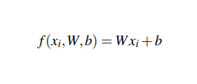</center>

Giả sử rằng mỗi xi được biểu diễn dưới dạng một vectơ cột đơn có hình dạng [D×1] (trong ví dụ này, chúng ta sẽ làm phẳng hình ảnh 32×32×3 thành một danh sách gồm 3.072 số nguyên). Khi đó, ma trận trọng số W của chúng ta sẽ có dạng [K ×D] (số lượng nhãn lớp theo kích thước của hình ảnh đầu vào). Cuối cùng b, vectơ phân cực sẽ có kích thước [K × 1]. Vectơ sai lệch cho phép chúng ta thay đổi và dịch hàm tính điểm theo hướng này hay hướng khác mà không thực sự ảnh hưởng đến ma trận trọng số W. Tham số sai lệch thường rất quan trọng để học thành công.]
Với bộ Animal, ta có size W =[3 x3072] và bias có size = [3x1]
Hình 8.1 minh họa hàm tính điểm phân loại tuyến tính f . Ở bên trái, chúng tôi có hình ảnh đầu vào ban đầu, được biểu thị dưới dạng hình ảnh 32×32×3. Sau đó, chúng tôi làm phẳng hình ảnh này thành một danh sách có cường độ 3.072 pixel bằng cách lấy mảng 3D và định hình lại nó thành danh sách 1D
<center>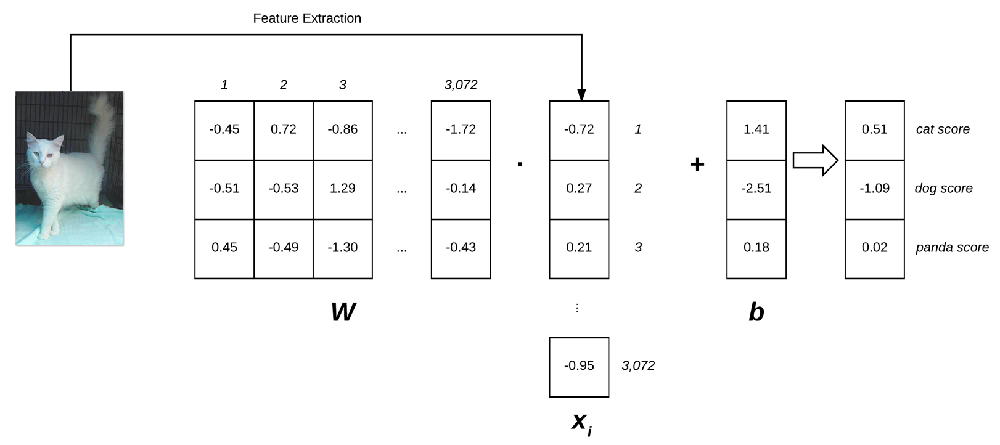</center>

<center><font size="-1">Hình 8.1 minh họa hàm tính điểm phân loại tuyến tính f . Ở bên trái, chúng tôi có hình ảnh đầu vào ban đầu, được biểu thị dưới dạng hình ảnh 32×32×3. Sau đó, chúng tôi làm phẳng hình ảnh này thành một danh sách có cường độ 3.072 pixel bằng cách lấy mảng 3D và định hình lại nó thành danh sách 1D</font></center>
Ma trận trọng số W của chúng tôi chứa ba hàng (một cho mỗi nhãn lớp) và 3.072 cột (một cho mỗi pixel trong ảnh). Sau khi lấy tích vô hướng giữa W và xi , chúng tôi thêm vào vectơ độ lệch b – kết quả là hàm tính điểm thực tế của chúng tôi. Hàm tính điểm của chúng tôi mang lại ba giá trị ở bên phải: điểm số tương ứng với nhãn chó, mèo và gấu trúc.

Chúng ta sẽ xem xét các loss function ở phần sau của chương này. Các phương pháp tối ưu hóa như gradient descent (và các biến thể của nó) sẽ được thảo luận trong Chương 9. Tuy nhiên, hiện tại, hãy hiểu đơn giản rằng với một hàm tính điểm, chúng ta cũng sẽ xác định một hàm mất mát cho chúng ta biết các dự đoán của chúng ta “tốt” đến mức nào. trên dữ liệu đầu vào

Có hai lợi thế chính khi sử dụng học tập tham số hóa:
1. Sau khi hoàn thành việc huấn luyện mô hình của mình, chúng ta có thể loại bỏ dữ liệu đầu vào và chỉ giữ lại ma trận trọng số W và vectơ độ lệch b. Điều này làm giảm đáng kể kích thước mô hình của chúng tôi vì chúng tôi cần lưu trữ hai bộ vectơ (so với toàn bộ tập huấn luyện).
2. Phân loại dữ liệu thử nghiệm mới nhanh chóng. Để thực hiện phân loại, tất cả những gì chúng ta cần làm là lấy tích vô hướng của W và xi , sau đó thêm vào độ lệch b (tức là áp dụng hàm tính điểm của chúng ta). Làm theo cách này nhanh hơn đáng kể so với việc so sánh từng điểm kiểm tra với từng ví dụ huấn luyện, như trong thuật toán k-NN.

Bây giờ chúng ta đã xem xét khái niệm học tập được tham số hóa và phân loại tuyến tính, hãy triển khai một trình phân loại tuyến tính rất đơn giản bằng Python. Mục đích của ví dụ này không phải là để chứng minh cách chúng ta đào tạo một mô hình từ đầu đến cuối (chúng ta sẽ đề cập đến điều đó trong chương sau vì chúng ta vẫn còn một số nền tảng cần giải quyết trước khi sẵn sàng đào tạo một mô hình từ đầu), mà chỉ đơn giản là trình bày cách chúng ta sẽ khởi tạo ma trận trọng số W, vectơ độ lệch b, sau đó sử dụng các tham số này để phân loại hình ảnh thông qua một tích chấm đơn giản. Hãy tiếp tục và bắt đầu ví dụ này. Mục tiêu của chúng ta ở đây là viết một tập lệnh Python sẽ phân loại chính xác 


### 8.2 Loss funtion

Để cải thiện độ chính xác phân loại của chúng tôi, chúng tôi cần điều chỉnh các tham số của ma trận trọng số W hoặc vectơ độ lệch b. Chính xác thì cách chúng tôi cập nhật các thông số này là một vấn đề tối ưu hóa, chúng tôi sẽ đề cập đến vấn đề này trong chương tiếp theo. Hiện tại, hãy hiểu một cách đơn giản rằng hàm mất mát có thể được sử dụng để định lượng mức độ hoạt động của hàm tính điểm trong việc phân loại các điểm dữ liệu đầu vào. Lý tưởng nhất là loss của chúng tôi sẽ giảm theo thời gian khi chúng tôi điều chỉnh các tham số mô hình của mình
#### 8.2.1 Multi-class SVM Loss
Multi-class SVM Loss được lấy cảm hứng từ (Tuyến tính) Máy vectơ hỗ trợ (SVM) sử dụng hàm tính điểm f để ánh xạ điểm dữ liệu của chúng tôi thành điểm số cho từng nhãn lớp. Hàm f này là một ánh xạ học đơn giản:
<center>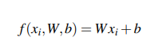</center>

Bây giờ chúng ta đã có chức năng tính điểm, chúng ta cần xác định mức độ “tốt” hay “xấu” của chức năng này (với ma trận trọng số W và vectơ độ lệch b) khi đưa ra dự đoán. Để đưa ra quyết định này, chúng ta cần một hàm mất mát. Nhớ lại rằng khi tạo mô hình học máy, chúng ta có ma trận thiết kế X, trong đó mỗi hàng trong X chứa một điểm dữ liệu mà chúng ta muốn phân loại. Trong bối cảnh phân loại hình ảnh, mỗi hàng trong X là một hình ảnh và chúng tôi tìm cách gắn nhãn hình ảnh này một cách chính xác. Chúng ta có thể truy cập hình ảnh thứ i bên trong X thông qua cú pháp xi . Tương tự, chúng ta cũng có một vectơ y chứa các nhãn lớp của chúng ta cho mỗi X. Các giá trị y này là nhãn sự thật cơ bản và là những gì chúng ta hy vọng chức năng tính điểm của mình sẽ dự đoán chính xác. Giống như chúng ta có thể truy cập một hình ảnh nhất định dưới dạng xi , chúng ta có thể truy cập nhãn lớp được liên kết thông qua yi .

Ta có hàm mất mát : 
<center>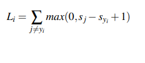</center>

Về cơ bản, hàm mất bản lề đang tính tổng trên tất cả các lớp không chính xác (i # j) và so sánh đầu ra của hàm tính điểm s được trả về cho nhãn lớp thứ j (lớp không chính xác) và lớp thứ yi (lớp đúng ). Chúng tôi áp dụng thao tác tối đa để kẹp các giá trị ở mức 0, điều này rất quan trọng để đảm bảo chúng tôi không tính tổng các giá trị âm

Một xi đã cho được phân loại chính xác khi tổn thất Li = 0 (Tôi sẽ cung cấp một ví dụ bằng số trong phần sau). Để tính được loss trên toàn bộ tập huấn luyện của chúng tôi, chúng tôi chỉ cần lấy giá trị trung bình cho từng Li riêng lẻ :
<center>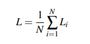</center>

Hàm loss khác là : 
<center>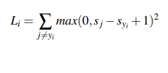</center>

Về việc bạn nên sử dụng hàm mất mát nào, điều đó hoàn toàn phụ thuộc vào tập dữ liệu của bạn. Thông thường, hàm mất bản lề tiêu chuẩn được sử dụng nhiều hơn, nhưng trên một số tập dữ liệu, biến thể bình phương có thể đạt độ chính xác cao hơn. Nhìn chung, đây là một siêu tham số mà bạn nên cân nhắc điều chỉnh

#### 8.2.2 Cross-entropy Loss và Softmax Classifiers
Dù hinge loss khá phổ biến nhưng bạn sẽ thích cross=entropy và Softmax loss trong deeplearning và neural networks

Tại sao lại thế này ? softmax classifers giúp khả năng của từng nhãn trội hơn ở các khoảng giới hạn

Bộ phân loại Softmax là sự tổng quát hóa dạng nhị phân của Hồi quy logistic. Giống như hinge loss hoặc squared hinge loss, hàm ánh xạ f được xác định sao cho nó nhận một tập dữ liệu đầu vào xi và ánh xạ chúng tới các nhãn lớp đầu ra thông qua tích vô hướng của dữ liệu xi và ma trận trọng số W
<center>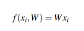</center>
Những scores này là những xác suất chưa được chuẩn hóa cho mỗi lớp, ta có cross-entropy loss: 
<center>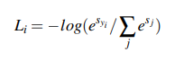</center>
Hàm loss function sẽ giảm thiểu hợp lý cực đại (log likehood) của class chính xác
<center>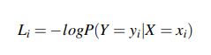</center>
xác suất có thể được hiểu là:
<center>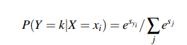</center>
 Hãy lưu ý rằng logarit của bạn ở đây thực sự là cơ số e (logarit tự nhiên) vì chúng ta đang lấy nghịch đảo của lũy thừa trên e trước đó. Phép lũy thừa và chuẩn hóa thực tế thông qua tổng các số mũ là hàm Softmax của chúng tôi. Việc tính toán cross-entropy loss trên toàn bộ tập dữ liệu được thực hiện bằng cách lấy giá trị trung bình:
 <center>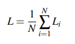</center>
 các ví dụ bằng số trong phần tiếp theo để đảm bảo bạn hiểu cách thức hoạt động của cross-entropy loss
 <center>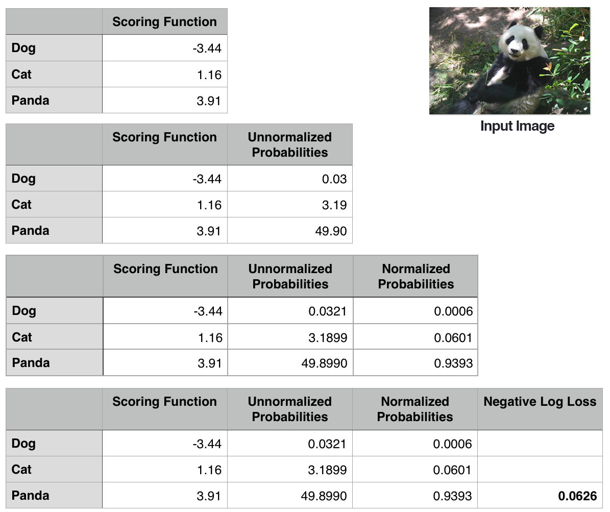</center>
<center><font size="-1">Hình 8.2: Bảng đầu tiên: Để tính toán cross entropy loss, hãy bắt đầu với đầu ra của hàm score. Bảng thứ hai: Việc lũy thừa các giá trị đầu ra từ hàm tính điểm mang lại cho chúng ta các xác suất không chuẩn hóa. Bảng thứ ba: Để có được xác suất thực tế, chúng tôi chia từng xác suất không chuẩn hóa riêng lẻ cho tổng của tất cả các xác suất không chuẩn hóa. Bảng thứ tư: Lấy logarit tự nhiên âm của xác suất cho sự thật cơ bản chính xác mang lại tổn thất cuối cùng cho điểm dữ liệu.</font></center>

Bảng đầu tiên bao gồm đầu ra của hàm tính điểm f tương ứng cho từng lớp trong ba lớp. Các giá trị này là xác suất nhật ký không chuẩn hóa của chúng tôi cho ba lớp. Hãy lũy thừa e đầu ra của hàm tính điểm (e^s , trong đó s là giá trị hàm điểm của chúng ta), mang lại xác suất không chuẩn hóa của chúng tôi (bảng thứ hai).
Bước tiếp theo là lấy mẫu số = tổng số các unnormalized probabilities, và dùng unnormalized probabilities của lớp đang xét chia cho tổng đó. Cuối cùng, chúng ta có thể lấy logarit tự nhiên âm, −ln(p), trong đó p là xác suất chuẩn hóa, mang lại loss cuối cùng của chúng ta (bảng thứ tư và bảng cuối cùng).

Trong trường hợp này, trình phân loại Softmax của chúng tôi sẽ báo cáo chính xác hình ảnh là gấu trúc với độ tin cậy 93,93%. Sau đó, chúng tôi có thể lặp lại quy trình này cho tất cả các hình ảnh trong tập huấn luyện của mình, lấy giá trị trung bình và thu được tổn thất entropy chéo tổng thể cho tập huấn luyện. Quá trình này cho phép chúng tôi định lượng mức độ tốt hay xấu của một tập tham số đang hoạt động trên tập huấn luyện của chúng tôi.

 [Xem tiếp chương 9](../Chuong9/chuong9.md)