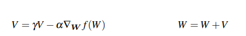

# <center> Welcome to Computer Vision</center>
 **<center>Trần Việt Anh - Hoàng Nguyên Phương</center>** 

 ## 9. Phương pháp tối ưu hóa và chính quy hóa
Làm thế nào để chúng ta tìm và thu được một ma trận trọng số W và véc tơ thiên vị b để đạt được độ chính xác phân loại cao? Chúng ta có khởi tạo chúng một cách ngẫu nhiên, đánh giá và lặp đi lặp lại nhiều lần, hy vọng rằng tại một thời điểm nào đó, chúng ta sẽ đạt được một tập hợp các tham số có được sự phân loại hợp lý không? Chúng tôi có thể - nhưng do các mạng học sâu hiện đại có các tham số lên tới hàng chục triệu, chúng tôi có thể mất nhiều thời gian để tìm ra một tập hợp các tham số hợp lý một cách mù quáng.

Thay vì dựa vào tính ngẫu nhiên thuần túy, chúng ta cần xác định thuật toán tối ưu hóa cho phép chúng ta cải thiện W và b theo đúng nghĩa đen. Trong chương này, chúng ta sẽ xem xét thuật toán phổ biến nhất được sử dụng để đào tạo mạng lưới thần kinh và các mô hình học sâu – gradient descent. gradient descent có nhiều biến thể (chúng ta cũng sẽ đề cập đến), nhưng trong mỗi trường hợp, ý tưởng đều giống nhau: đánh giá lặp đi lặp lại các tham số của bạn, tính toán tổn thất của bạn, sau đó thực hiện một bước nhỏ theo hướng sẽ giảm thiểu tổn thất của bạn.

### 9.1 Gradient Descent
Thuật toán giảm độ dốc có hai hương vị chính:
1. Cách thực hiện "vanilla" chuẩn.
2.  “stochastic” được tối ưu hóa thường được sử dụng hơn. Trong phần này, chúng tôi sẽ xem xét việc triển khai vanilla cơ bản để tạo cơ sở cho sự hiểu biết của chúng tôi.

au khi chúng tôi hiểu những điều cơ bản về gradient descent, chúng tôi sẽ chuyển sang phiên bản “stochastic”. Sau đó, chúng tôi sẽ xem xét một số "bells and whistles" mà chúng tôi có thể thêm vào để gradient descent, bao gồm động lượng và gia tốc Nesterov.

#### 9.1.1 Bối cảnh loss và bề mặt tối ưu hóa

Phương pháp gradient descent là một thuật toán tối ưu hóa lặp hoạt động trên không gian loss (còn được gọi là bề mặt tối ưu hóa). Ví dụ gradient descent chính tắc là trực quan hóa các trọng số của chúng ta dọc theo trục x và sau đó là loss đối với một tập hợp các trọng số nhất định dọc theo trục y (Hình 9.1, bên trái):

 <center></center>
<center><font size="-1">Hình 9.1: Trái: “naive loss” được hiển thị dưới dạng biểu đồ 2D. Đúng: Một cảnh mất mát thực tế hơn có thể được hình dung như một cái bát tồn tại ở nhiều chiều. Mục tiêu của chúng tôi là áp dụng gradient descent để điều hướng đến đáy của bát này (nơi có mức độ mất mát thấp)..</font></center>

Mỗi điểm cực là đại diện loss rất cao (local minimum), mức tối đa loss lớn nhất là global maximum. local minimum có nhiều vùng loss khác. Local minimum mà có loss nhỏ nhất thì là our gloval minimum. Chúng tôi sẽ tìm global munimum để đảm bảo các tham số của chúng tôi nhận các giá trị tối ưu nhất có thể.
Chúng ta thật sự không biết global miminum như thế nào. húng ta sẽ phải điều hướng theo cách của mình để giảm loss minimum mà không vô tình leo lên đỉnh của  local maximum.

Cá nhân tác giả chưa bao giờ thích cách trực quan hóa bối cảnh mất mát này - nó quá đơn giản và nó thường khiến người đọc nghĩ rằng việc gradient descent (và các biến thể của nó) cuối cùng sẽ tìm thấy mức tối thiểu cục bộ hoặc global tối thiểu. Phát biểu này không đúng, đặc biệt là đối với những bài toán phức tạp – và tôi sẽ giải thích lý do tại sao ở phần sau của chương này. Thay vào đó, hãy xem xét một cách hình dung khác về bối cảnh mất mát mà tôi tin rằng sẽ mô tả vấn đề tốt hơn. Ở đây chúng ta có một cái bát, tương tự như cái bát mà bạn có thể ăn ngũ cốc hoặc súp (Hình 9.1, bên phải).

Sự khác biệt giữa cảnh mất mát của chúng tôi và bát ngũ cốc của bạn là bát ngũ cốc của bạn chỉ tồn tại ở ba chiều, trong khi cảnh mất mát của bạn tồn tại ở nhiều chiều, có thể là hàng chục, hàng trăm hoặc hàng nghìn chiều. Mỗi vị trí dọc theo bề mặt của bát tương ứng với một giá trị tổn thất cụ thể được cung cấp một bộ tham số W (ma trận trọng số) và b (vector độ lệch). Mục tiêu của chúng tôi là thử các giá trị khác nhau của W và b, đánh giá tổn thất của chúng và sau đó thực hiện một bước hướng tới các giá trị tối ưu hơn (lý tưởng) có tổn thất thấp hơn.
 <center></center>
<center><font size="-1">Hình 9.2: Trái: Robot của chúng tôi, Chad. Đúng: Nhiệm vụ của Chad là điều hướng bối cảnh mất mát của chúng ta và đi xuống đáy vực. Thật không may, cảm biến duy nhất mà Chad có thể sử dụng để kiểm soát điều hướng của mình là một chức năng đặc biệt, được gọi là chức năng mất mát, L. Chức năng này phải hướng dẫn anh ta đến một khu vực có mức độ mất mát thấp hơn.</font></center>
Để làm cho lời giải thích của chúng ta về giảm dần độ dốc trực quan hơn một chút, hãy giả sử rằng chúng ta có một rô-bốt – hãy đặt tên cho nó là Chad (Hình 9.2, bên trái). Khi thực hiện giảm độ dốc, chúng tôi thả ngẫu nhiên Chad ở đâu đó trên vùng mất mát của chúng tôi (Hình 9.2, bên phải).

Bây giờ nhiệm vụ của Chad là điều hướng đến đáy của lưu vực (nơi có minimum loss). Có vẻ nghe dễ? Tất cả những gì Chad phải làm là định hướng bản thân sao cho anh ấy đang đối mặt với việc “xuống dốc” và trượt dốc cho đến khi chạm tới đáy bát. Nhưng đây là vấn đề: Chad không phải là một người máy thông minh lắm. Chad chỉ có một cảm biến – cảm biến này cho phép anh ta lấy các tham số W và b của mình, sau đó tính toán hàm tổn thất L. Do đó, Chad có thể tính toán vị trí tương đối của mình trên bối cảnh tổn thất, nhưng anh ta hoàn toàn không biết mình đi theo hướng nào. nên tiến thêm một bước để nhích mình đến gần đáy vực. Chad để làm gì? Câu trả lời là áp dụng gradient descent. Tất cả những gì Chad cần làm là tuân theo độ dốc của gradient W. Chúng ta có thể tính toán gradient W trên tất cả các kích thước bằng phương trình sau: 
 <center></center>
 Trong các chiều> 1, gradient của chúng tôi trở thành một vectơ của các đạo hàm riêng. Vấn đề với phương trình này là:
 1. Nó gần đúng với gradient.
2. Nó rất chậm.
Trong thực tế, chúng tôi sử dụng gradient phân tích để thay thế. Phương pháp này chính xác và nhanh chóng, nhưng cực kỳ khó thực hiện do đạo hàm riêng và phép tính nhiều biến. Nguồn gốc đầy đủ của phép tính đa biến được sử dụng để chứng minh gradient nằm ngoài phạm vi của cuốn sách này. 

 chỉ cần tiếp thu gradient descent là gì: cố gắng tối ưu hóa các tham số của chúng tôi để có độ hao hụt thấp và độ chính xác phân loại cao thông qua quy trình lặp đi lặp lại để thực hiện một bước theo hướng giảm thiểu độ hao hụt.

 Nếu một số hàm F lồi, thì tất cả các cực tiểu cục bộ cũng là cực tiểu global. Ý tưởng này phù hợp với hình dung của cái bát một cách độc đáo. Thuật toán tối ưu hóa của chúng tôi chỉ đơn giản là đưa một đôi ván trượt ở trên cùng của bát, sau đó từ từ đi xuống dốc cho đến khi chúng tôi chạm tới đáy. Vấn đề là gần như tất cả các vấn đề chúng tôi áp dụng mạng thần kinh và thuật toán học sâu cho các hàm lồi, không gọn gàng. Thay vào đó, bên trong chiếc bát này, chúng ta sẽ tìm thấy những đỉnh giống như mũi nhọn, những thung lũng giống với hẻm núi hơn, những đoạn dốc xuống và thậm chí cả những khe mà tổn thất giảm đáng kể chỉ để tăng mạnh trở lại.

 Chúng ta có thể đặt kỳ vọng cao về việc tìm ra mức minimum local/global khi đào tạo mạng học sâu, nhưng kỳ vọng này hiếm khi phù hợp với thực tế. Thay vào đó, cuối cùng chúng tôi tìm thấy một khu vực có tổn thất thấp – khu vực này thậm chí có thể không phải là mức tối thiểu local, nhưng trên thực tế, nó chỉ ra rằng điều này là đủ tốt

 Trước khi chúng ta chuyển sang triển khai gradient descent, tôi muốn dành thời gian để thảo luận về một kỹ thuật gọi là "bias trick", một phương pháp kết hợp ma trận trọng số W và vectơ thiên vị b của chúng ta thành một tham số duy nhất. Nhớ lại từ các quyết định trước đây của chúng tôi rằng score function của chúng tôi được định nghĩa là:
  <center></center>
  Việc theo dõi hai biến riêng biệt, cả về giải thích và triển khai thường rất tẻ nhạt – để tránh tình trạng này hoàn toàn, chúng ta có thể kết hợp W và b với nhau. Để kết hợp cả ma trận độ lệch và trọng số, chúng tôi thêm chiều không gian bổ sung(tức là cột) vào dữ liệu đầu vào X của chúng tôi giữ hằng số 1 – đây là chiều bias của chúng tôi


Thông thường, chúng tôi sẽ nối thêm dim mới cho từng xi riêng lẻ vào dim đầu hoặc dim cuối cùng. Trong thực tế, nó không quan trọng. Chúng ta có thể chọn bất kỳ vị trscore function của mình thông qua một phép nhân ma trận duy nhất:
  <center></center>
  Một lần nữa, chúng tôi được phép bỏ qua thuật ngữ b ở đây vì nó được nhúng vào ma trận trọng số W của chúng tôi. Trong ngữ cảnh của các ví dụ trước của chúng tôi trong bộ dữ liệu “Động vật”, chúng tôi đã làm việc với hình ảnh 32 × 32 × 3 với tổng số 3.072 pixel. Mỗi xi được biểu diễn bằng một vectơ [3072 × 1]. Việc thêm vào một thứ nguyên có giá trị không đổi là một giờ sẽ mở rộng vectơ thành [3073 × 1]. Tương tự, việc kết hợp cả ma trận độ chệch và trọng số cũng mở rộng ma trận trọng số W của chúng ta thành [3×3073] thay vì [3×3072]. Bằng cách này, chúng ta có thể coi độ lệch là một tham số có thể học được trong ma trận trọng số mà chúng ta không cần phải theo dõi rõ ràng trong một biến riêng biệt.
<center></center>
<center><font size="-1">Hình 9.2: Trái: Thông thường chúng ta coi ma trận trọng số và vectơ thiên vị là hai tham số riêng biệt. Phải: chúng ta thực sự có thể nhúng vectơ bias vào ma trận trọng số W(do đó làm cho nó trở thành một tham số có thể huấn luyện trực tiếp bên trong ma trận trọng số bằng cách khởi tạo ma trận trọng số của chúng ta với một cột phụ. </font></center>

Để hình dung bias trick, hãy xem Hình 9.3 (trái) nơi chúng ta tách biệt ma trận trọng số W và độ lệch b. Cho đến bây giờ, con số này mô tả cách chúng tôi nghĩ về score function của mình. hưng thay vào đó, chúng ta có thể kết hợp W và b với nhau, với điều kiện là chúng ta chèn một cột mới vào mỗi xi trong đó mỗi mục nhập là một (Hình 9.3, bên phải). Áp dụng bias trick cho phép chúng ta chỉ học một ma trận trọng số W duy nhất, do đó tại sao chúng ta có xu hướng thích phương pháp này hơn để thực hiện. Đối với tất cả các ví dụ sau này trong cuốn sách này, bất cứ khi nào tôi đề cập đến W, hãy giả sử rằng vectơ độ lệch b cũng được bao gồm hoàn toàn trong ma trận trọng số. 
Dưới đây có code về vanilla gradient descent: 
```python
1 while True:
2    Wgradient = evaluate_gradient(loss, data, W)
3    W += -alpha * Wgradient
```
Đoạn code này là thứ mà tất cả các biến thể của gradient descent được tạo ra.
Chúng tôi bắt đầu trên Dòng 1 bằng cách lặp cho đến khi một số điều kiện được đáp ứng, thường là:
1. Một số lượng epochs đã trôi qua (có nghĩa là thuật toán học tập của chúng tôi đã “nhìn thấy” từng điểm dữ liệu huấn luyện N lần).
2. Loss của chúng tôi đã trở nên đủ thấp hoặc độ chính xác đào tạo đạt yêu cầu cao.
3. Loss không được cải thiện trong M epochs tiếp theo.

Dòng 2 sau đó gọi một hàm có tên là đánh giá_gradient. Chức năng này yêu cầu ba tham số:
1. loss: Một chức năng được sử dụng để tính toán loss trên các thông số hiện tại của chúng tôi W và dữ liệu đầu vào.
2. data: Dữ liệu đào tạo của chúng tôi trong đó mỗi mẫu đào tạo được biểu thị bằng một hình ảnh (hoặc vectơ đặc trưng).
3. W: Ma trận độ trọng W thực tế mà chúng tôi đang tối ưu hóa. Mục tiêu của chúng tôi là áp dụng gradient descentc để tìm W mang lại minimal loss.

Hàm đánh giá_gradient trả về một vectơ có K chiều, trong đó K là số chiều trong vectơ hình ảnh/đối tượng địa lý của chúng ta. Biến Wgradient là độ dốc thực tế, nơi chúng tôi có mỗi gradient cho mỗi chiều
Sau đó, chúng tôi áp dụng giảm dần độ dốc trên Dòng 3. Chúng tôi nhân Wgradient của mình với alpha (α), đây là tỷ lệ học tập của chúng tôi. Tỷ lệ học tập kiểm soát kích thước của step của chúng tôi. Trên thực tế, bạn sẽ mất nhiều thời gian để tìm giá trị tối ưu của α – cho đến nay, đây là thông số quan trọng nhất trong mô hình của bạn. Nếu α quá lớn, bạn sẽ dành toàn bộ thời gian của mình để xoay quanh cảnh mất mát, không bao giờ thực sự “hạ xuống” đáy vực (trừ khi cú nảy ngẫu nhiên của bạn đưa bạn đến đó hoàn toàn là do may mắn). Ngược lại, nếu α quá nhỏ, thì sẽ mất nhiều (có lẽ là rất nhiều) lần lặp để đến đáy lưu vực. Việc tìm giá trị tối ưu của α sẽ khiến bạn đau đầu – và bạn sẽ dành một khoảng thời gian cân nhắc để cố gắng tìm giá trị tối ưu cho biến này cho mô hình và tập dữ liệu của mình.

Bây giờ chúng ta đã biết những kiến thức cơ bản về giảm dần độ dốc, hãy triển khai nó trong Python và sử dụng nó để phân loại một số dữ liệu. Mở một tệp mới, đặt tên là gradient_descent.py và chèn đoạn mã sau:

```python 
1 # import the necessary packages
2 from sklearn.model_selection import train_test_split
3 from sklearn.metrics import classification_report
4 from sklearn.datasets import make_blobs
5 import matplotlib.pyplot as plt
6 import numpy as np
7 import argparse
8
9 def sigmoid_activation(x):
10  # compute the sigmoid activation value for a given input
11  return 1.0 / (1 + np.exp(-x))

```

Các dòng 2-7 nhập các gói Python cần thiết của chúng tôi. Chúng tôi đã thấy tất cả các lần nhập này trước đây, ngoại trừ make_blobs, một chức năng được sử dụng để tạo “đốm màu" của các điểm dữ liệu được phân phối thông thường – đây là một chức năng hữu ích khi thử nghiệm hoặc triển khai các mô hình của riêng chúng tôi từ đầu. Sau đó, chúng tôi xác định chức năng sigmoid_activation trên Dòng 9. Khi được vẽ biểu đồ, chức năng này sẽ giống như một đường cong hình chữ “S” (Hình 9.4). Chúng tôi gọi nó là chức năng kích hoạt vì chức năng này sẽ “kích hoạt” và kích hoạt "ON" (giá trị đầu ra > 0,5) hoặc "OFF" (giá trị đầu ra <= 0,5) dựa trên đầu vào x.
Chúng ta có thể xác định mối quan hệ này thông qua phương thức dự đoán bên dưới:
<center></center>
<center><font size="-1">Hình 9.3: Hàm kích hoạt sigmoid. Hàm này có tâm tại x = 0,5, y = 0,5. Các chức năng bão hòa ở đuôi.. </font></center>

Chỉ cần lưu ý rằng sigmoid là một chức năng kích hoạt phi tuyến tính mà chúng ta có thể sử dụng để xác định ngưỡng của mình để phỏng đoán
```python
26 ap = argparse.ArgumentParser()
27 ap.add_argument("-e", "--epochs", type=float, default=100,
28 help="# of epochs")
29 ap.add_argument("-a", "--alpha", type=float, default=0.01,
30 help="learning rate")
31 args = vars(ap.parse_args())
32
33 # generate a 2-class classification problem with 1,000 data points,
34 # where each data point is a 2D feature vector
35 (X, y) = make_blobs(n_samples=1000, n_features=2, centers=2,
36 cluster_std=1.5, random_state=1)
37 y = y.reshape((y.shape[0], 1))
38
39 # insert a column of 1’s as the last entry in the feature
40 # matrix -- this little trick allows us to treat the bias
41 # as a trainable parameter within the weight matrix
42 X = np.c_[X, np.ones((X.shape[0]))]
43
44 # partition the data into training and testing splits using 50% of
45 # the data for training and the remaining 50% for testing
46 (trainX, testX, trainY, testY) = train_test_split(X, y,
47 test_size=0.5, random_state=42)

```
Trên Dòng 35, chúng tôi thực hiện lệnh gọi make_blobs tạo ra 1.000 điểm dữ liệu được phân tách thành hai lớp. Các điểm dữ liệu này là 2D, ngụ ý rằng "các vectơ đặc trưng" có độ dài 2. Nhãn cho từng điểm dữ liệu này là 0 hoặc 1. Mục tiêu của chúng tôi là đào tạo một trình phân loại dự đoán chính xác nhãn lớp cho từng điểm dữ liệu.
Dòng 42 áp dụng “thủ thuật thiên vị” (chi tiết ở trên) cho phép chúng ta bỏ qua việc theo dõi một cách rõ ràng vectơ thiên vị b, bằng cách chèn một cột hoàn toàn mới gồm 1 giây làm mục nhập cuối cùng trong ma trận thiết kế X của chúng ta.
Việc thêm một cột chứa một giá trị không đổi trên tất cả các vectơ đặc trưng cho phép chúng tôi coi độ lệch của mình là một tham số có thể huấn luyện trong ma trận trọng số W chứ không phải là một biến hoàn toàn riêng biệt. Khi chúng tôi đã chèn cột của những cái, chúng tôi phân chia dữ liệu thành phần tách đào tạo và kiểm tra của mình trên Dòng 46 và 47, sử dụng 50% dữ liệu để đào tạo và 50% để kiểm tra. Khối mã tiếp theo của chúng tôi xử lý khởi tạo ngẫu nhiên ma trận trọng số của chúng tôi bằng cách sử dụng phân phối đồng nhất sao cho nó có cùng số chiều với các tính năng đầu vào của chúng tôi (bao gồm cả độ lệch):
```python
49 # initialize our weight matrix and list of losses
50 print("[INFO] training...")
51 W = np.random.randn(X.shape[1], 1)
52 losses = []

```
Bạn cũng có thể thấy cả khởi tạo trọng số 0 và trọng số một, nhưng như chúng ta sẽ tìm hiểu ở phần sau của cuốn sách này, việc khởi tạo tốt là rất quan trọng để huấn luyện mạng nơ-ron trong một khoảng thời gian hợp lý, do đó, việc khởi tạo ngẫu nhiên cùng với các phương pháp phỏng đoán đơn giản sẽ thắng trong đại đa số hoàn cảnh. Dòng 52 khởi tạo một danh sách để theo dõi các khoản loss của chúng tôi sau mỗi epoch. Khi kết thúc tập lệnh Python của bạn, chúng tôi sẽ vẽ sơ đồ loss (lý tưởng là sẽ giảm dần theo thời gian). Tất cả các biến của chúng tôi hiện đã được khởi tạo, vì vậy chúng tôi có thể chuyển sang quy trình đào tạo và gradient descent thực tế:
```python 
54 # loop over the desired number of epochs
55 for epoch in np.arange(0, args["epochs"]):
56  # take the dot product between our features ‘X‘ and the weight
57  # matrix ‘W‘, then pass this value through our sigmoid activation
58  # function, thereby giving us our predictions on the dataset
59  preds = sigmoid_activation(trainX.dot(W))
60
61  # now that we have our predictions, we need to determine the
62  # ‘error‘, which is the difference between our predictions and
63  # the true values
64  error = preds - trainY
65  loss = np.sum(error ** 2)
66  losses.append(loss)
67
68  # the gradient descent update is the dot product between our
69  # features and the error of the predictions
70  gradient = trainX.T.dot(error)
71
72  # in the update stage, all we need to do is "nudge" the weight
73  # matrix in the negative direction of the gradient (hence the
74  # term "gradient descent" by taking a small step towards a set
75  # of "more optimal" parameters
76  W += -args["alpha"] * gradient
77
78  # check to see if an update should be displayed
79  if epoch == 0 or (epoch + 1) % 5 == 0:
80      print("[INFO] epoch={}, loss={:.7f}".format(int(epoch + 1),loss))
```

Trên Dòng 55, chúng tôi bắt đầu lặp qua số lượng --epoch được cung cấp. Theo mặc định, chúng tôi sẽ cho phép quy trình đào tạo “xem” từng điểm đào tạo tổng cộng 100 lần (do đó, 100 kỷ nguyên). Dòng 59 lấy tích vô hướng giữa toàn bộ tập huấn luyện trainX và ma trận trọng số W. Đầu ra của tích vô hướng này được cung cấp thông qua chức năng kích hoạt sigmoid, mang lại dự đoán của chúng tôi. Với các dự đoán của chúng tôi, bước tiếp theo là xác định “lỗi” của các dự đoán, hay đơn giản hơn là sự khác biệt giữa các dự đoán của chúng tôi và các giá trị thực (Dòng 64). Dòng 65 tính toán sai số bình phương nhỏ nhất so với dự đoán của chúng tôi, một tổn thất đơn giản thường được sử dụng cho các bài toán phân loại nhị phân. Mục tiêu của quy trình đào tạo này là giảm thiểu lỗi bình phương nhỏ nhất của chúng tôi. Chúng tôi thêm lossnày vào danh sách các khoản loss của chúng tôi trên Dòng 66, để sau này chúng tôi có thể lập biểu đồ về mảng loss theo thời gian. Bây giờ chúng tôi có loss chúng tôi có thể tính toán gradient và sau đó sử dụng nó để cập nhật ma trận trọng số W của chúng tôi.

Dòng 70 xử lý tính toán gradient descent, là tích vô hướng giữa các điểm dữ liệu X của chúng tôi và loss. Dòng 76 là bước quan trọng nhất trong thuật toán của chúng tôi và là nơi diễn ra quá trình gradient descent thực tế. Ở đây, chúng tôi cập nhật ma trận trọng số W của mình bằng cách thực hiện một bước theo hướng âm của độ dốc, do đó cho phép chúng tôi di chuyển về phía dưới cùng của lưu vực của cảnh quan mất mát (do đó có thuật ngữ, độ dốc giảm dần). Sau khi cập nhật ma trận trọng số của chúng tôi, chúng tôi kiểm tra xem liệu một bản cập nhật có được hiển thị terminal của chúng tôi hay không (Dòng 79-81) và sau đó tiếp tục lặp lại cho đến khi đạt được số lượng kỷ nguyên mong muốn – do đó, giảm dần độ dốc là một thuật toán lặp. Trình phân loại của chúng tôi hiện đã được đào tạo. Bước tiếp theo là đánh giá:

```python 
83 # evaluate our model
84 print("[INFO] evaluating...")
85 preds = predict(testX, W)
86 print(classification_report(testY, preds))
```

Để thực sự đưa ra dự đoán bằng cách sử dụng ma trận trọng số W, chúng tôi gọi phương thức dự đoán trên testX và W trên Dòng 85. Dựa trên các dự đoán, chúng tôi hiển thị báo cáo phân loại được định dạng đẹp mắt cho terminal  của mình trên Dòng 86.
Khối mã cuối cùng của chúng tôi xử lý biểu đồ (1) dữ liệu thử nghiệm để chúng tôi có thể hình dung tập dữ liệu mà chúng tôi đang cố gắng phân loại và (2) sự mất mát của chúng tôi theo thời gian:
```python
88 # plot the (testing) classification data
89 plt.style.use("ggplot")
90 plt.figure()
91 plt.title("Data")
92 plt.scatter(testX[:, 0], testX[:, 1], marker="o", c=testY, s=30)
93
94 # construct a figure that plots the loss over time
95 plt.style.use("ggplot")
96 plt.figure()
97 plt.plot(np.arange(0, args["epochs"]), losses)
98 plt.title("Training Loss")
99 plt.xlabel("Epoch #")
100 plt.ylabel("Loss")
101 plt.show()

```
#### 9.1.2 Kết quả
<center></center>
<center><font size="-1">Hình 9.3:Bên trái: Tập dữ liệu đầu vào mà chúng tôi đang cố gắng phân loại thành hai bộ: đỏ và xanh lam. Tập dữ liệu này rõ ràng có thể phân tách tuyến tính vì chúng ta có thể vẽ một đường duy nhất phân chia tập dữ liệu thành hai lớp một cách gọn gàng. Bên phải: Tìm hiểu một tập hợp các tham số để phân loại tập dữ liệu của chúng tôi thông qua giảm dần độ dốc. Tổn thất bắt đầu rất cao nhưng nhanh chóng giảm xuống gần như bằng không </font></center>

Như chúng ta có thể thấy từ Hình 9.5 (trái), tập dữ liệu của chúng ta rõ ràng là có thể phân tách tuyến tính (nghĩa là chúng ta có thể vẽ một đường phân tách hai loại dữ liệu). Tổn thất của chúng tôi cũng giảm đáng kể, bắt đầu rất cao và sau đó nhanh chóng giảm xuống (phải). Chúng ta có thể thấy tổn thất giảm nhanh như thế nào bằng cách điều tra đầu ra của thiết bị đầu cuối ở trên. Lưu ý mức độ mất mát ban đầu > 400 nhưng giảm xuống ≈ 1,0 vào kỷ nguyên 50. Vào thời điểm đào tạo kết thúc vào kỷ nguyên 100, tổn thất của chúng tôi đã giảm theo thứ tự độ lớn xuống 0,02.

Biểu đồ này xác nhận rằng ma trận trọng số của chúng tôi đang được cập nhật theo cách cho phép trình phân loại học hỏi từ dữ liệu đào tạo. Tuy nhiên, dựa trên phần còn lại của đầu ra thiết bị đầu cuối của chúng tôi, có vẻ như trình phân loại của chúng tôi đã phân loại sai một số điểm dữ liệu (< 5 trong số đó):
```python

[INFO] evaluating...
            precision recall   f1-score   support
0           1.00      0.99      1.00        250
1           0.99      1.00      1.00        250
avg / total 1.00      1.00      1.00        500

```
Để ý class 0 để phân loại đúng 100%, còn class 1 phân loại đúng 99%. Tùy thuộc vào việc khởi tạo ma trận trọng số và kích thước của tốc độ học, có thể chúng ta không học được một mô hình có thể phân tách các điểm (mặc dù chúng có thể phân tách tuyến tính). Trên thực tế, các lần chạy tiếp theo của tập lệnh này có thể tiết lộ rằng cả hai lớp đều CÓ THỂ được phân loại chính xác 100%.

ết quả phụ thuộc vào các giá trị ban đầu mà W nhận. Để tự xác minh kết quả này, hãy chạy tập lệnh gradient_descent.py nhiều lần. Đối với việc gradient descent đơn giản, bạn nên đào tạo nhiều epochs hơn với learning rate nhỏ hơn để giúp khắc phục vấn đề này. Tuy nhiên, như chúng ta sẽ thấy trong phần tiếp theo, một biến thể của gradient descent có tên là Stochastic Gradient Descent thực hiện cập nhật trọng số cho mỗi đợt dữ liệu đào tạo, ngụ ý rằng có nhiều cập nhật trọng số cho mỗi epoch. Cách tiếp cận này dẫn đến sự hội tụ nhanh hơn, ổn định hơn.

### 9.2 Stochastic Gradient Descent (SGD)

Trong phần trước, chúng ta đã thảo luận về gradient descent, một thuật toán tối ưu hóa bậc nhất có thể được sử dụng để tìm hiểu một tập hợp các trọng số phân loại cho quá trình học được tham số hóa. Tuy nhiên, việc “vanilla” triển khai gradient descent ày có thể chạy rất chậm trên các tập dữ liệu lớn – trên thực tế, nó thậm chí có thể được coi là lãng phí tính toán. Thay vào đó, chúng ta nên áp dụng Stochastic Gradient Descent (SGD), một sửa đổi đơn giản cho thuật toán gradient descent tiêu chuẩn để tính toán gradient và cập nhật ma trận trọng số W trên các lô nhỏ dữ liệu huấn luyện, thay vì toàn bộ tập huấn luyện. Mặc dù sửa đổi này dẫn đến các bản cập nhật “ồn ào hơn”, nhưng nó cũng cho phép chúng tôi thực hiện nhiều bước hơn dọc theo gradient (1 step trên từng batch với step trên từng epoch). cuối cùng dẫn đến sự hội tụ nhanh hơn và không ảnh hưởng tiêu cực đến độ chính xác của phân loại và mất mát. SGD được cho là thuật toán quan trọng nhất khi đào tạo mạng lưới thần kinh sâu. Mặc dù hiện thân ban đầu của SGD đã được giới thiệu hơn 57 năm trước, nhưng nó vẫn là công cụ cho phép chúng tôi đào tạo các mạng lớn để học các mẫu từ các điểm dữ liệu. Trên tất cả các thuật toán khác được đề cập trong cuốn sách này, hãy dành thời gian để hiểu SGD.
#### 9.2.1 Mini-batch SGD

Xem lại thuật toán vanilla gradient descent, rõ ràng là (phần nào) phương pháp này sẽ chạy rất chậm trên các bộ dữ liệu lớn. Xem lại thuật toán giảm dần độ dốc vani, rõ ràng là (phần nào) phương pháp này sẽ chạy rất chậm trên các bộ dữ liệu lớn. Lý do cho sự chậm chạp này là vì mỗi lần lặp lại quá trình giảm dần độ dốc yêu cầu chúng tôi tính toán dự đoán cho từng điểm huấn luyện trong dữ liệu huấn luyện trước khi chúng tôi được phép cập nhật ma trận trọng số của mình. Đối với các bộ dữ liệu hình ảnh như ImageNet, chúng tôi có hơn 1,2 triệu hình ảnh đào tạo, quá trình tính toán này có thể mất nhiều thời gian. Nó cũng chỉ ra rằng việc tính toán các dự đoán cho mọi điểm đào tạo trước khi thực hiện một bước dọc theo ma trận trọng số của chúng tôi là lãng phí về mặt tính toán và không giúp được gì nhiều cho phạm vi mô hình của chúng tôi. Thay vào đó, những gì chúng ta nên làm là cập nhật hàng loạt. Chúng tôi có thể cập nhật mã giả để chuyển đổi vanilla gradient descent thành SGD bằng cách thêm một lệnh gọi hàm bổ sung:

```python
1 while True:
2   batch = next_training_batch(data, 256)
3   Wgradient = evaluate_gradient(loss, batch, W)
4   W += -alpha * Wgradient
```

Sự khác biệt duy nhất giữa vanilla gradient descent và SGD là việc bổ sung chức năng next_training_batch. Thay vì tính toán độ dốc của chúng tôi trên toàn bộ tập dữ liệu, thay vào đó, chúng tôi lấy mẫu dữ liệu của mình, thu được một batch. húng tôi đánh giá độ dốc trên lô và cập nhật ma trận trọng số W. Từ góc độ triển khai, chúng tôi cũng cố gắng ngẫu nhiên hóa các mẫu đào tạo của mình trước khi áp dụng SGD vì thuật toán nhạy cảm với các lô. Sau khi xem code cho SGD, bạn sẽ nhận thấy ngay phần giới thiệu về một tham số mới: batch-size. hi triển khai SGD “thuần túy”, mini-batches size của bạn sẽ là 1, ngụ ý rằng chúng tôi sẽ lấy mẫu ngẫu nhiên một điểm dữ liệu từ tập huấn luyện, tính toán gradient và cập nhật các tham số của chúng tôi. Tuy nhiên, chúng tôi thường sử dụng mini-batches> 1. Batchsize điển hình bao gồm 32, 64, 128 và 256.
Để bắt đầu, batchsize > 1 giúp giảm phương sai trong cập nhật tham số, dẫn đến sự hội tụ ổn định hơn. Thứ hai, lũy thừa của hai thường được mong muốn đối với các batchsize vì chúng cho phép các thư viện tối ưu hóa đại số tuyến tính bên trong hoạt động hiệu quả hơn.

#### 9.2.1 Triển khai SGD
```python
1 # import the necessary packages
2 from sklearn.model_selection import train_test_split
3 from sklearn.metrics import classification_report
4 from sklearn.datasets import make_blobs
5 import matplotlib.pyplot as plt
6 import numpy as np
7 import argparse
8
9 def sigmoid_activation(x):
10  # compute the sigmoid activation value for a given input
11  return 1.0 / (1 + np.exp(-x))
13 def predict(X, W):
14  # take the dot product between our features and weight matrix
15  preds = sigmoid_activation(X.dot(W))
16
17  # apply a step function to threshold the outputs to binary
18  # class labels
19  preds[preds <= 0.5] = 0
20  preds[preds > 0] = 1
21
22  # return the predictions
23  return preds

```
Từ 1-> 23 đều giống file gradient descent trước. Tiếp theo là next_batch: 
```python
25 def next_batch(X, y, batchSize):
26   # loop over our dataset ‘X‘ in mini-batches, yielding a tuple of
27   # the current batched data and labels
28   for i in np.arange(0, X.shape[0], batchSize):
29      yield (X[i:i + batchSize], y[i:i + batchSize])

```
Phương thức next_batch yêu cầu ba tham số:
1. X: Tập dữ liệu đào tạo của chúng tôi về vectơ đặc trưng/cường độ pixel ảnh thô.
2. y: Các nhãn lớp được liên kết với từng điểm dữ liệu huấn luyện.
3. batchSize: Kích thước của mỗi mini-batch sẽ được trả lại.
Các dòng 28 và 29 sau đó lặp lại các ví dụ huấn luyện, tạo ra các tập con của cả X và y dưới dạng các mini-batches.

Blockcode tiếp theo của chúng tôi xử lý việc tạo ra vấn đề phân loại 2 lớp với 1.000 điểm dữ liệu, thêm cột thiên vị, sau đó thực hiện phân tách đào tạo và kiểm tra:
```python
41 # generate a 2-class classification problem with 1,000 data points,
42 # where each data point is a 2D feature vector
43 (X, y) = make_blobs(n_samples=1000, n_features=2, centers=2,
44 cluster_std=1.5, random_state=1)
45 y = y.reshape((y.shape[0], 1))
46
47 # insert a column of 1’s as the last entry in the feature
48 # matrix -- this little trick allows us to treat the bias
49 # as a trainable parameter within the weight matrix
50 X = np.c_[X, np.ones((X.shape[0]))]
51
52 # partition the data into training and testing splits using 50% of
53 # the data for training and the remaining 50% for testing
54 (trainX, testX, trainY, testY) = train_test_split(X, y,
55 test_size=0.5, random_state=42)
56
57 # initialize our weight matrix and list of losses
58 print("[INFO] training...")
59 W = np.random.randn(X.shape[1], 1)
60 losses = []
```
Tiếp theo đưa mini-batches vào từng epochs: 
```python
62 # loop over the desired number of epochs
63 for epoch in np.arange(0, args["epochs"]):
64 # initialize the total loss for the epoch
65 epochLoss = []
66
67   # loop over our data in batches
68   for (batchX, batchY) in next_batch(X, y, args["batch_size"]):
69     # take the dot product between our current batch of features
70     # and the weight matrix, then pass this value through our
71     # activation function
72     preds = sigmoid_activation(batchX.dot(W))
73
74     # now that we have our predictions, we need to determine the
75     # ‘error‘, which is the difference between our predictions
76     # and the true values
77     error = preds - batchY
78     epochLoss.append(np.sum(error ** 2))
80     # the gradient descent update is the dot product between our
81     # current batch and the error on the batch
82     gradient = batchX.T.dot(error)
83
84     # in the update stage, all we need to do is "nudge" the
85     # weight matrix in the negative direction of the gradient
86     # (hence the term "gradient descent") by taking a small step
87     # towards a set of "more optimal" parameters
88     W += -args["alpha"] * gradient
```
Dòng 88 xử lý việc cập nhật ma trận trọng số của chúng tôi dựa trên gradient descent, được chia tỷ lệ theo learning rate của chúng tôi --alpha. ưu ý cách giai đoạn cập nhật trọng số diễn ra bên trong batch loop – điều này có nghĩa là có nhiều cập nhật trọng số cho mỗi epoch. Sau đó, chúng tôi có thể cập nhật lịch sử tổn thất của mình bằng cách lấy giá trị trung bình trên tất cả các đợt trong kỷ nguyên và sau đó hiển thị bản cập nhật cho terminal của chúng tôi nếu cần:
```python

90  # update our loss history by taking the average loss across all
91  # batches
92  loss = np.average(epochLoss)
93  losses.append(loss)
94
95  # check to see if an update should be displayed
96  if epoch == 0 or (epoch + 1) % 5 == 0:
97    print("[INFO] epoch={}, loss={:.7f}".format(int(epoch + 1),loss))
98
99
100 # evaluate our model
101 print("[INFO] evaluating...")
102 preds = predict(testX, W)
103 print(classification_report(testY, preds))
104
105 # plot the (testing) classification data
106 plt.style.use("ggplot")
107 plt.figure()
108 plt.title("Data")
109 plt.scatter(testX[:, 0], testX[:, 1], marker="o", c=testY, s=30)
110
111 # construct a figure that plots the loss over time
112 plt.style.use("ggplot")
113 plt.figure()
114 plt.plot(np.arange(0, args["epochs"]), losses)
115 plt.title("Training Loss")
116 plt.xlabel("Epoch #")
117 plt.ylabel("Loss")
118 plt.show()

```
Chúng ta sẽ sử dụng tập dữ liệu “blob” giống như ở trên để phân loại, nhờ đó chúng ta có thể so sánh kết quả SGD của mình với kết quả vanilla gradient descent. Hơn nữa, ví dụ SGD sử dụng cùng tốc độ học tập (0,1) và cùng số lượng kỷ nguyên (100) như giảm dần độ dốc vani. Tuy nhiên, hãy lưu ý rằng đường cong tổn thất của chúng ta mượt mà hơn như thế nào trong Hình 9.4.
<center></center>
<center><font size="-1">Hình 9.4: Áp dụng Stochastic Gradient Descent mượt hơn </font></center>

Điều tra các giá trị tổn thất thực tế vào epoch thứ 100, bạn sẽ nhận thấy rằng tổn thất mà SGD thu được thấp hơn một bậc so với vanilla gradient descent(tương ứng là 0,003 so với 0,021). Sự khác biệt này là do có nhiều lần cập nhật trọng số trên mỗi epoch, giúp mô hình của chúng tôi có nhiều cơ hội hơn để học hỏi từ các bản cập nhật được thực hiện cho ma trận trọng số. Hiệu ứng này thậm chí còn rõ rệt hơn trên các bộ dữ liệu lớn, chẳng hạn như ImageNet nơi chúng tôi có hàng triệu ví dụ đào tạo và các cập nhật nhỏ, gia tăng trong các tham số của chúng tôi có thể dẫn đến giải pháp tổn thất thấp (nhưng không nhất thiết phải tối ưu).

### 9.3 Mở rộng SGD

Có hai phần mở rộng chính mà bạn sẽ gặp đối với SGD trong thực tế. Đầu tiên là momentum , một phương pháp được sử dụng để tăng tốc SGD, cho phép nó học nhanh hơn bằng cách tập trung vào các  chiều có gradient point theo cùng một hướng. Phương pháp thứ hai là gia tốc Nesterov, một phần mở rộng của momentum tiêu chuẩn.

#### 9.3.1 Mementum

Hãy nghĩ đến sân chơi thời thơ ấu yêu thích của bạn, nơi bạn đã trải qua nhiều ngày lăn xuống một ngọn đồi, phủ đầy cỏ và đất. Khi bạn đi xuống đồi, bạn ngày càng tạo ra nhiều động lượng hơn, do đó sẽ đưa bạn xuống đồi nhanh hơn.
Động lượng áp dụng cho SGD có tác dụng tương tự – mục tiêu của chúng tôi là xây dựng dựa trên bản cập nhật trọng lượng tiêu chuẩn để bao gồm một thuật ngữ động lượng, do đó cho phép mô hình của chúng tôi đạt được tổn thất thấp hơn (và độ chính xác cao hơn) trong ít thời gian hơn. Do đó, thuật ngữ động lượng sẽ tăng cường độ cập nhật cho các epoch có điểm gradient theo cùng một hướng và sau đó giảm cường độ cập nhật cho các chiều có gradients  chuyển hướng

Quy tắc cập nhật trọng số trước đây của chúng tôi chỉ đơn giản bao gồm phụ thuộc thay đổi gradient và learning rate của chúng tôi:
<center></center>
Bây giờ có động lượng V được scale theo γ: 
<center></center>

Thuật ngữ động lượng γ thường được đặt thành 0,9; mặc dù một thực tế phổ biến khác là đặt γ thành 0,5 cho đến khi quá trình học ổn định rồi tăng lên 0,9 – cực kỳ hiếm khi thấy động lượng < 0,5. Để xem xét chi tiết hơn về động lượng, vui lòng tham khảo Sutton và Qian

#### 9.3.2 Gia tốc Nesterov

Giả sử rằng bạn quay trở lại sân chơi thời thơ ấu của mình, lăn xuống ngọn đồi. Bạn đã tạo đà và đang di chuyển khá nhanh – nhưng có một vấn đề. Ở dưới chân đồi là bức tường gạch của trường học của bạn, ngôi trường mà bạn muốn tránh đánh ở tốc độ tối đa.

Suy nghĩ tương tự cũng có thể được áp dụng cho SGD. Nếu chúng ta tạo ra quá nhiều động lượng, chúng ta có thể vượt quá mức tối thiểu cục bộ và tiếp tục lăn. Do đó, sẽ có lợi nếu có một lần lăn thông minh hơn, một loại biết khi nào nên giảm tốc độ, đó là nơi gradient tăng tốc Nesterov xuất hiện.
Gia tốc Nesterov có thể được khái niệm hóa như một bản cập nhật điều chỉnh động lượng cho phép chúng ta có được ý tưởng gần đúng về vị trí của các tham số sau khi cập nhật. trực quan đẹp về gia tốc Nesterov (Hình 9.5).

<center></center>
<center><font size="-1">Hình 9.5: Mô tả bằng đồ thị về gia tốc Nesterov Đầu tiên, chúng tôi thực hiện một bước nhảy lớn theo hướng của độ gradient trước đó, sau đó đo gradient nơi chúng tôi kết thúc và thực hiện hiệu chỉnh. </font></center>
Sử dụng động lượng tiêu chuẩn, chúng tôi tính toán gradient (vectơ nhỏ màu xanh lam) và sau đó thực hiện một bước nhảy lớn theo hướng của độ dốc (vectơ lớn màu xanh lam). Dưới khả năng tăng tốc của Nesterov, trước tiên, chúng tôi sẽ thực hiện một bước nhảy lớn theo hướng của độ dốc trước đó (vectơ màu nâu), đo độ dốc và sau đó thực hiện hiệu chỉnh (vectơ màu đỏ) – vectơ màu xanh lá cây là bản cập nhật được sửa lỗi cuối cùng bằng khả năng tăng tốc của Nesterov
Việc xử lý thấu đáo về lý thuyết và toán học đối với gia tốc Nesterov nằm ngoài phạm vi của cuốn sách này. Đối với những người muốn nghiên cứu gia tốc Nesterov chi tiết hơn, vui lòng tham khảo Ruder

#### 9.3.3 Anecdotal Recommendations

Kinh nghiệm cá nhân của tôi đã khiến tôi nhận thấy rằng khi đào tạo các mạng sâu trên các bộ dữ liệu lớn, SGD sẽ dễ làm việc hơn khi sử dụng động lượng và loại bỏ gia tốc Nesterov. Mặt khác, các bộ dữ liệu nhỏ hơn có xu hướng tận hưởng những lợi ích của việc tăng tốc Nesterov.

### 9.4 Regularization

Làm cách nào để chúng ta chọn một tập hợp các tham số giúp đảm bảo mô hình của chúng ta khái quát hóa tốt? Hoặc, ít nhất, làm giảm tác động của việc overfitting. Câu trả lời là chính quy hóa (Regularization). Chỉ đứng sau learning rate của bạn, chính quy hóa là thông số quan trọng nhất của mô hình mà bạn có thể điều chỉnh. Có nhiều loại kỹ thuật chuẩn hóa khác nhau, chẳng hạn như chuẩn hóa L1, chuẩn hóa L2 (thường được gọi là “phân rã trọng số” weight decay) và Elastic Net được sử dụng bằng cách cập nhật chính hàm loss function, thêm một tham số bổ sung để hạn chế khả năng của model. húng tôi cũng có các loại chính quy hóa có thể được thêm một cách rõ ràng vào kiến trúc mạng – dropout là ví dụ điển hình của quy chuẩn hóa đó. Sau đó, chúng tôi có các hình thức chính quy hóa tiềm ẩn được áp dụng trong quá trình đào tạo. Ví dụ về chính quy ngầm bao gồm tăng cường dữ liệu và dừng sớm. Trong phần này, chúng ta sẽ chủ yếu tập trung vào việc chính quy hóa được tham số hóa thu được bằng cách sửa đổi các hàm mất mát và cập nhật của chúng ta

Chính quy hóa giúp chúng tôi kiểm soát dung lượng mô hình của mình, đảm bảo rằng các mô hình của chúng tôi thực hiện phân loại (chính xác) tốt hơn trên các điểm dữ liệu mà chúng không được đào tạo, cái mà chúng tôi gọi là khả năng khái quát hóa. Nếu chúng tôi không áp dụng chính quy hóa, các trình phân loại của chúng tôi có thể dễ dàng trở nên quá phức tạp và quá khớp với dữ liệu đào tạo của chúng tôi, trong trường hợp đó, chúng tôi sẽ mất khả năng khái quát hóa dữ liệu thử nghiệm của mình (và cả các điểm dữ liệu bên ngoài bộ thử nghiệm, chẳng hạn như hình ảnh mới trong thế giới hoang dã).
Tuy nhiên, quá nhiều chính quy hóa có thể là một điều xấu. Chúng ta có thể gặp rủi ro về underfitting, , trong trường hợp đó, mô hình của chúng ta hoạt động kém trên dữ liệu huấn luyện và không thể mô hình hóa mối quan hệ giữa dữ liệu đầu vào và nhãn lớp đầu ra (vì chúng ta đã giới hạn dung lượng mô hình quá nhiều) Ví dụ, hãy xem xét đồ thị các điểm sau đây, cùng với các chức năng khác nhau phù hợp với các điểm này (Hình 9.6).
<center></center>
<center><font size="-1">Hình 9.6: Một ví dụ về underfit(đường màu cam), overfit (đường màu xanh lam) và tổng quát hóa (đường màu xanh lá cây). Mục tiêu của chúng tôi khi xây dựng các bộ phân loại học sâu là thu được các loại “hàm green" này phù hợp với dữ liệu đào tạo của chúng tôi một cách độc đáo, nhưng tránh overfiting. Chính quy hóa có thể giúp chúng tôi có được loại phù hợp mong muốn này. </font></center>

Để hiểu quy tắc hóa và tác động của nó đối với loss function và quy tắc cập nhật trọng lượng của chúng tôi, hãy chuyển sang phần tiếp theo.

#### 9.4.2 Cập nhật loss function và trọng số W để bao gồm chính quy hóa